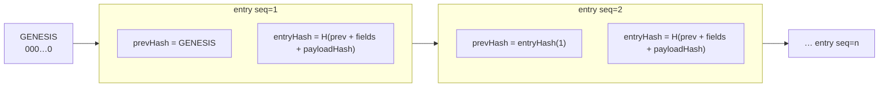
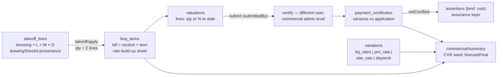
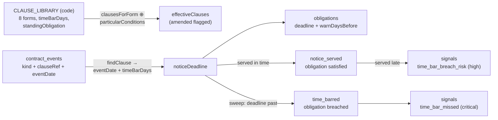
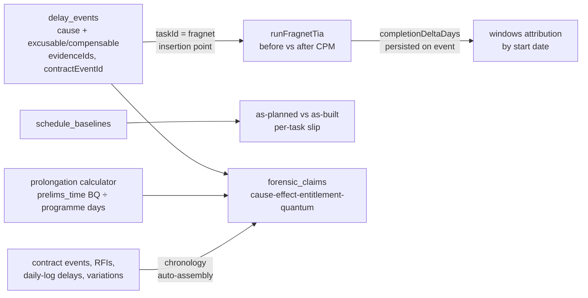
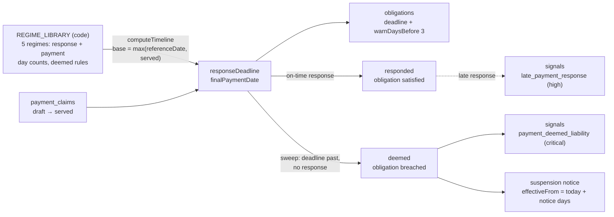

# ConstructOS — System Architecture

Engineering reference for the ConstructOS monorepo. Every statement below is grounded in
committed code; file paths are given so claims can be checked against the source. For the
product-level functional inventory see `docs/master-specification.md` (cited throughout as
"spec", with Volume and function numbers).

---

## 1. Product thesis

ConstructOS is two products sharing one data plane:

1. **A Procore-class construction delivery platform** — projects, directory, documents,
   drawings, BIM, RFIs, submittals, daily logs, punch, photos, workflow, notifications
   (spec Vol I, Sections 0–2).
2. **An owner-side assurance layer** — the wedge identified in spec Vol III §1–2: Procore's
   core assertion is *"here is what our users entered"*; the structural gap is *"here is what
   actually happened, and here is where the two diverge."* Reconciliation between a party's
   **Assertion** and independent **Evidence** is the product; everything else is scaffolding
   around the `reconciliations` table (spec Vol III §4, primitive 3).

The two halves are deliberately coupled at one point only: **every consequential mutation on
the delivery side is appended to the tenant's hash-chained evidence ledger**
(`apps/api/src/lib/ledger.ts`), so operational records accrete evidentiary weight as a side
effect of normal use. The assurance primitives (assertions, evidence, reconciliations,
obligations, events, entities, signals, ledger — spec Vol III §4) live in
`packages/db/src/schema/assurance.ts` and are served by `apps/api/src/modules/assurance/`.

Why the incumbent cannot follow (spec Vol III §2): the assurance layer's output is adverse to
the party that pays the incumbent's invoice. ConstructOS is built so the owner, funder,
auditor or regulator is a first-class principal — see the segregated assurance roles in
`packages/shared/src/permissions.ts` (`ASSURANCE_ROLES`) and `docs/security.md`.

---

## 2. Monorepo map

pnpm workspace, Node ≥ 22, TypeScript 5.9 strict ESM throughout (`package.json`,
`pnpm-workspace.yaml`).

| Path | Package | Contents |
|---|---|---|
| `packages/shared` | `@constructos/shared` | Domain vocabulary: enums (`src/enums.ts`), RBAC model + built-in permission templates (`src/permissions.ts`), wire types (`src/types.ts`), the eight assurance primitive interfaces (`src/primitives.ts`). No runtime dependencies. |
| `packages/ledger` | `@constructos/ledger` | Pure crypto core: RFC 8785-style canonical JSON (`src/canonical.ts`), SHA-256 helpers (`src/hash.ts`), hash chain build/verify (`src/chain.ts`), Merkle root/proof (`src/merkle.ts`). Unit-tested in `src/ledger.test.ts`. |
| `packages/db` | `@constructos/db` | Drizzle ORM schema, one file per domain (`src/schema/*.ts`), committed SQL migrations (`drizzle/`). Postgres dialect; no FK constraints — relationships are by convention (see `docs/data-model.md`). |
| `apps/api` | `@constructos/api` | Fastify 5 API. Composition root `src/app.ts`, env config `src/config.ts`, auth plugin `src/plugins/auth.ts`, helpers `src/lib/*.ts` (incl. the pure CPM engine `src/lib/cpm.ts`), eighteen feature modules `src/modules/*/`, test harness `src/test/helpers.ts`. |
| `apps/web` | `@constructos/web` | Vite 8 + React 19 + Tailwind v4 SPA. Route table `src/App.tsx`, API client `src/lib/api.ts`, auth context `src/lib/auth.tsx`, shared UI kit `src/ui/`, feature pages `src/pages/*/`. Client-side PDF rendering via `pdfjs-dist`, IFC via `web-ifc` + `three`. |
| `docs/` | — | This documentation set plus the master specification. |
| `docker-compose.yml` | — | Postgres 16 for production-like runs. |
| `Dockerfile` / `railway.json` | — | Production image (API + SPA + migrations in one container; see §3 "Production packaging") and Railway build/healthcheck descriptor. Runbook: `docs/deployment.md`. |
| `.github/workflows/ci.yml` | — | CI: pnpm install → `pnpm typecheck` → `pnpm build` → `pnpm test` on Node 22. |

Dependency direction is strictly downward: `apps/*` → `packages/db` / `packages/ledger` /
`packages/shared`; packages never import from apps; `shared` imports nothing.

---

## 3. Runtime topology


- **API process**: `apps/api/src/index.ts` builds the app via `buildApp()` (`src/app.ts`) and
  listens on `PORT`/`HOST` from `src/config.ts`. Body limit 32 MB; multipart uploads up to
  1 GB / 25 files per request (`app.ts`).
- **Database**: one Drizzle schema, two backends (`apps/api/src/lib/db.ts`). With
  `DATABASE_URL` set, `postgres-js` against real Postgres (see `docker-compose.yml`); unset,
  embedded PGlite — persisted to `PGLITE_DIR` in dev, purely in-memory under `NODE_ENV=test`.
  Migrations from `packages/db/drizzle` are applied automatically at startup in both modes.
- **Storage — driver selection**: two content-addressed drivers behind the narrow
  `StorageService` interface, chosen by `STORAGE_DRIVER` at composition time
  (`apps/api/src/app.ts` decorates `app.storage` with one or the other):
  `local` (`apps/api/src/lib/storage.ts`, dev default) writes
  `<STORAGE_DIR>/<companyId>/<sha256[0:2]>/<sha256>`; `s3`
  (`apps/api/src/lib/storage-s3.ts`, production) writes the identical key scheme to any
  S3-compatible store (Railway Buckets, AWS S3, R2, MinIO) via `S3_*` config, recording the
  sha256 as object metadata. Because the key scheme is shared, a stored `storageKey` never
  changes when switching drivers, identical payloads dedupe in both, and the address
  attests to content either way (spec Domain S #862).
- **Web**: the Vite dev server proxies `/api` to the API (`apps/web/vite.config.ts`). In
  production there is no proxy at all — **the API serves the built SPA same-origin**
  (`apps/api/src/app.ts`): when `WEB_DIST_DIR` points at a build, `@fastify/static` serves
  it with hashed `/assets/*` marked `immutable` and `index.html` `no-cache`, and a
  not-found handler falls back to `index.html` for any non-`/api/` GET (client-side
  routing). The SPA's absolute `/api/v1/...` calls therefore need no CORS and no rewrite,
  and helmet's CSP (same file) covers app and API from one origin.
- **Production packaging**: the repo-root `Dockerfile` builds one image containing the
  pruned API bundle, the committed migrations (`/app/migrations`, applied automatically at
  boot by `lib/db.ts`) and the built SPA (`/app/public`), running as non-root `USER node`
  with `TRUST_PROXY=true`. `railway.json` declares the Dockerfile build and the
  `/api/v1/health` healthcheck; the full operator runbook is `docs/deployment.md`.
- **AI**: optional outbound dependency on the Anthropic API, gated on `ANTHROPIC_API_KEY`
  (`apps/api/src/modules/ai/service.ts`); see §15.
- **Health**: `GET /api/v1/health` reports which database backend is live (`app.ts`).

---

## 4. Request lifecycle

Every operational route composes the same preHandler chain, declared as Fastify decorators in
`apps/api/src/plugins/auth.ts` and typed in `apps/api/src/types.ts`:

```mermaid
sequenceDiagram
    participant C as Client
    participant A as authenticate
    participant T as requireCompany
    participant R as requireTool(tool, level)
    participant H as Handler
    participant L as appendLedger

    C->>A: Authorization: Bearer <JWT>
    A->>A: jwtVerify (HS256, jose) → load user, check isActive
    A->>T: req.user set
    C->>T: x-company-id header
    T->>T: companyMemberships lookup → req.companyId, req.companyRole
    T->>R: tenant resolved
    R->>R: project belongs to tenant? → req.projectId
    R->>R: owner/admin bypass, else template + overrides → meetsLevel()
    R->>R: else assurance grant → read-only access
    R->>H: authorized
    H->>H: zod .parse(body/query) — ZodError → 400
    H->>H: DB write, companyId + projectId scoped
    H->>L: append hash-chained entry (same request; failure fails the request)
    H-->>C: response (AppError → typed JSON error envelope)
```

Key properties, all visible in `plugins/auth.ts`:

- **`authenticate`** verifies the bearer JWT (HS256 via `jose`, secret from
  `AUTH_SECRET`), re-loads the user row and rejects deactivated users.
- **`requireCompany`** resolves the tenant from the `x-company-id` header against
  `company_memberships` — a valid token alone never grants tenant access.
- **`requireTool(tool, level)`** (routes carrying `:projectId`) first proves the project
  belongs to the tenant, then resolves the caller's effective permission:
  company owner/admin bypass → project membership template (`permission_templates` row, falling
  back to `BUILTIN_PERMISSION_TEMPLATES` in `packages/shared/src/permissions.ts`) + per-user
  `overrides` → `resolveLevel`/`meetsLevel`. If that fails and the requested level is `read`,
  a live `assurance_grants` row (optionally project-scoped, optionally time-boxed via
  `expiresAt`) grants read-only visibility — auditors see everything, change nothing.
- **`requireCompanyRole` / `requireAssuranceRole`** gate company administration and the
  segregation-of-duties routes respectively (see `docs/security.md` §2–3).
- **Validation** is zod v4 `.parse()` in handlers; the global error handler in `app.ts` maps
  `ZodError` → 400 and `AppError` (`lib/errors.ts`) → its status, and hides 5xx details in
  production.
- **Ledger append** (`lib/ledger.ts`) runs after the operational write, in the same request.
  A failed append fails the request: an unledgered mutation is treated as worse than a
  rolled-back one.

---

## 5. Multi-tenancy model

- The **company** (`companies` table, `packages/db/src/schema/identity.ts`) is the tenant.
  Users are global (`users`) and join tenants through `company_memberships`; a user can belong
  to several companies (spec Vol I #1–2).
- Tenant context is explicit per request (`x-company-id`), never inferred from the token.
- **Every table that stores tenant data carries a `companyId` column, and every query is
  scoped by it** (convention enforced in review; there is no row-level security in the
  database — see `docs/security.md` §3 and §8). Project-scoped tables additionally carry and are
  filtered by `projectId`, which `requireTool` has already proven belongs to the tenant.
- Storage keys are prefixed with `companyId` (`lib/storage.ts`), so blobs are physically
  partitioned per tenant.
- The evidence ledger is **one chain per company** (`ledger_entries.companyId` +
  `prevHash`), so a tenant's history can be exported and verified without reference to any
  other tenant.

---

## 6. Module inventory

Eighteen Fastify plugins, each `apps/api/src/modules/<name>/index.ts`, all registered in
`src/app.ts` under the `/api/v1` prefix. "Tool" is the `requireTool` key from
`packages/shared/src/permissions.ts`; tables are from `packages/db/src/schema/`. Sibling
modules are being developed concurrently — the contracts below come from route registration
and schema, not implementation internals.

| Module | Tool gate(s) | Key tables | Representative routes | Spec coverage |
|---|---|---|---|---|
| `identity` | none (public auth) / `authenticate` | `users`, `companies`, `companyMemberships`, `refreshTokens`, `authEvents`, `permissionTemplates` | `POST /auth/register`, `/auth/login`, `/auth/refresh`, `/auth/logout`, `GET /me`, `GET|POST /companies` | Vol I §0.1 #1–2, #4, #13, #26 |
| `directory` | `directory` | `vendors`, `contacts`, `distributionGroups(+Members)`, `companyMemberships` | `GET|POST /vendors`, `POST /vendors/:id/merge`, `/contacts`, `/distribution-groups`, `/company/users` | Vol I §0.1 #7–12 |
| `admin` | `admin`, `requireCompanyRole(["owner","admin"])` | `permissionTemplates`, `projectMemberships`, `assuranceGrants`, `authEvents` | `/permission-templates`, `/projects/:projectId/memberships`, `/assurance-grants`, `/company/auth-events` | Vol I §0.1 #13–17, #26–27 |
| `projects` | `projects` | `projects`, `portfolios`, `locations`, `costCodes`, `wbsSegments`, `recordLinks`, `customFieldDefs/Values`, `comments`, `watchers`, `tags` | `GET|POST /projects`, `/projects/:id/locations`, `/cost-codes`, `/wbs`, `/links`, `/records/:type/:id/{comments,tags,watchers,custom-values}`, `/summary` | Vol I §0.3 #49–78 |
| `documents` | `documents` | `folders`, `files`, `fileVersions`, `fileAccessLog` | `/projects/:id/folders`, `/folders/:id/files` (multipart), `/files/:id/download`, `/files/:id/checkout|checkin`, `/files/:id/versions` | Vol I §2.3 #290–301 |
| `drawings` | `drawings` | `drawingSets`, `drawingSheets`, `drawingRevisions`, `drawingMarkups`, `drawingHyperlinks`, `drawingPins` | `/projects/:id/drawing-sets` (bulk PDF), `/sheets`, `/sheets/log`, `/revisions/:id/{markups,hyperlinks,calibration}`, `/sheets/:id/pins`, `/drawing-files/:fileId/pdf` | Vol I §2.1 #256–282 |
| `bim` | `bim` | `bimModels`, `bimModelVersions`, `bimElements`, `federationGroups(+Members)`, `coordinationIssues` | `/projects/:id/bim/models`, `/bim/models/:id/versions` (IFC upload), `/bim/versions/:id/elements`, `/bim/versions/:id/state` (CDE), `/bim/federations`, `/bim/issues` | Vol I §1.4 #231–248, §2.14 #465–470; Domain L #639–640 |
| `twin` | `twin` | `assets`, `assetElementLinks`, `sensors`, `sensorReadings`, `warranties`, `deliveryMilestones` | `/projects/:id/assets`, `/assets/from-element`, `/sensors/:id/readings`, `/warranties/expiring`, `/delivery-milestones`, `/cobie.{csv,json}` | Domain L #627–632, #635, #639–644, #658–659 |
| `workflow` | `workflow` | `workflowTemplates`, `workflowInstances`, `workflowStepInstances` | `/workflow-templates`, `/projects/:id/workflows/start`, `/workflow-steps/:id/{decide,delegate}`, `/me/workflow-inbox`, `/workflows/overdue` | Vol I §0.4 #79–92 |
| `field` | `rfis`, `submittals`, `daily_logs`, `punch`, `photos` | `rfis`, `submittals`, `submittalReviewSteps`, `dailyLogs`, `punchItems`, `photos` | `/projects/:id/rfis` (+`issue/respond/close/void`, `analytics`), `/submittals` (+review steps, `resubmit`), `/daily-logs/:date` (+`submit/approve`, `missing`), `/punch` (+`status`, `analytics`), `/photos` (+`albums`) | Vol I §2.4 #302–325, §2.5 #326–348, §2.7 #372–397, §2.8 #398–414, §2.10 #426–439 |
| `notifications` | authenticated user | `notifications` | `GET /notifications`, `/unread-count`, `POST /:id/read`, `/read-all` | Vol I §0.5 #93–97 |
| `assurance` | `assurance` + `requireAssuranceRole` on dispositions | `assertions`, `evidence`, `reconciliations`, `obligations`, `events`, `entities`, `entityRelationships`, `signals`, `ledgerEntries` | `/projects/:id/{assertions,evidence,reconciliations,obligations,events,signals}`, `/entities` (+graph, scan), `/projects/:id/detectors/run`, `/projects/:id/evidence-packs`, `/ledger`, `/ledger/verify` | Vol III §4 (all 8 primitives); Domain A detectors subset; Domain S #859, #862, #871–872, #882 |
| `ai` | `ai` (read/standard) | `aiRuns`, `aiReviewQueue` | `/projects/:id/ai/{search,assist,submittal-review,daily-log-draft,rfi-evaluate,sheet-name,photo-intel}`, `/ai/review` (+`approve/reject`), `/ai/runs` | Vol I §6.4 #759–775 subset; Domain X #1019–1021 |
| `commercial` | `commercial` | `boqs`, `boqItems`, `takeoffLines`, `valuations`, `valuationLines`, `paymentCertificates`, `variations` | `/projects/:id/boqs`, `/boqs/:id` (+`summary`), `/boqs/:id/items`, `/boq-items/:id/takeoff` (+`apply`), `/projects/:id/valuations`, `/valuations/:id/{lines,submit,certify}`, `/projects/:id/certificates`, `/projects/:id/variations` (+`status`, `value`), `/projects/:id/commercial/summary` | Vol II Domain B (M7) #115–116, #135–140, #145/149, #162–171, #179–180, #184 seed |
| `contracts` | `contracts` | `contracts`, `contractEvents`, `eotClaims` (+ writes assurance `obligations`, `signals`) | `/contract-forms` (+`/:form/clauses`), `/projects/:id/contracts` (+`status`, `deadlines`), `/contracts/:contractId/events` (+`serve-notice`, `status`), `/contracts/:contractId/eot-claims` (+`status`), `/contracts/:contractId/ld-exposure` | Vol II Domain C (M8) #193–196, #200–204 subset, #214–215, #225–231, #237–238, #249–250, #260 |
| `schedule` | `schedule` | `schedules`, `scheduleTasks`, `scheduleDependencies`, `scheduleBaselines` | `/projects/:id/schedules` (+`activate`, `compute`), `…/schedules/:id/tasks` (+`reorder`), `/schedule-tasks/:taskId`, `…/schedules/:id/dependencies`, `…/baselines` (+`compare`), `…/lookahead`, `…/quality` | Vol I §2.6 #351, #353–361; #371 / Domain D #283 (health check) |
| `forensics` | `forensics` | `delayEvents`, `forensicClaims` (+ reads schedule, contracts, commercial, field, assurance tables) | `/projects/:id/delay-events` (+`status`, `tia`), `/projects/:id/forensics/{as-planned-vs-as-built,windows,prolongation}`, `/projects/:id/claims` (+`status`, `chronology`) | Vol II Domain D (M9) #265, #267–269, #272–273 (scoped), #283, #299, #304–306, #310, #318 |
| `payments` | `payments` (regime library: authenticated only) | `paymentClaims`, `paymentResponses`, `suspensionNotices` (+ writes assurance `obligations`, `signals`) | `/payment-regimes` (+`/:regime`), `/projects/:id/payment-claims` (+`serve`, `respond`, `suspend`, `mark-paid`, `interest`), `/projects/:id/suspension-notices/:id/lift`, `/projects/:id/payments/{deadlines,analytics}` | Vol II Domain F (M10) #358–362, #364–369 subset, #386–387 |

Shared helpers used by all modules (`apps/api/src/lib/`): `ids.ts` (prefixed nanoid),
`numbering.ts` (atomic per-project record counters, spec #72), `pagination.ts`
(`page`/`pageSize` → `{items,total,page,pageSize}`), `errors.ts`, `ledger.ts`, `storage.ts`.

---

## 7. The evidence ledger

The evidentiary spine (spec Domain S #859; Vol III §4 primitive 8). Three layers:

**1. Canonicalization** (`packages/ledger/src/canonical.ts`). Payloads are hashed over an
RFC 8785-style canonical JSON encoding — sorted keys, `undefined` stripped, finite numbers
only, deterministic across engines — because a hash must be reproducible years later in front
of an auditor.

**2. Hash chain** (`packages/ledger/src/chain.ts`, persisted by `apps/api/src/lib/ledger.ts`
into `ledger_entries`). Each entry's `entryHash` is SHA-256 over its own fields
(`companyId`, `actorId`, `action`, `objectType`, `objectId`, `payloadHash`, `at`) **plus the
previous entry's hash**; the first entry chains from a 64-zero genesis sentinel.



Properties:

- **Append-only by contract**: rows in `ledger_entries` are never updated or deleted
  (schema comment, `packages/db/src/schema/assurance.ts`); the API exposes no mutating route.
- **Tamper-evident**: editing any historical row breaks every `entryHash` after it;
  `verifyChain` returns the index of the first break. Exposed as
  `GET /api/v1/ledger/verify` (assurance module) and `verifyCompanyLedger` in `lib/ledger.ts`.
- **Concurrency-safe**: appends run in a transaction that reads the current chain head, so
  concurrent writers serialize per company (`lib/ledger.ts`).
- **Payload-optional**: the chain always stores `payloadHash`; the full canonical snapshot is
  stored only when `storePayload: true` (high-value objects, e.g. company creation in
  `modules/identity/index.ts`), keeping the chain lean without weakening it.
- **Every module writes it**: the platform convention is that each create / update /
  state-change / delete of an operational record appends one entry with
  `action ∈ create|update|delete|state_change|access` (`LEDGER_ACTIONS`,
  `packages/shared/src/enums.ts`).

**3. Merkle evidence packs** (`packages/ledger/src/merkle.ts`;
`POST /projects/:projectId/evidence-packs` in the assurance module). A pack commits to a set
of evidence content-hashes under a single Merkle root, with per-leaf inclusion proofs
(odd nodes promoted, not duplicated, so a leaf cannot appear included twice). The root is a
single hash that can be escrowed with a third party or anchored externally — the committed
foundation for spec Domain S #860–861, #874, #882. Self-certification is surfaced on the
obligation path: satisfying an obligation records `selfCertified: ev.submittedBy === req.user.id`
in the ledger payload (`modules/assurance/index.ts`, obligation `/satisfy` route), so a reviewer
can weigh it later.

What the chain does and does not prove is analysed honestly in `docs/security.md` §5.

---

## 8. Drawings pipeline

Upload → extraction → sheet/revision model → markups/pins. All in
`apps/api/src/modules/drawings/` against `packages/db/src/schema/drawings.ts`.

1. **Bulk upload** (`POST /projects/:projectId/drawing-sets`, multipart): the source PDF is
   saved through content-addressed storage into `files`, and a `drawing_sets` row tracks the
   pipeline state machine `pending | processing | ready | failed`.
2. **Text extraction**: `extractPdfPages` (`modules/drawings/index.ts`) renders per-page text
   via `pdfjs-dist` — real text-layer extraction, not OCR of raster scans (scanned-image OCR
   is a known gap; the schema field is future-proofed as `extractedText`).
3. **Sheet detection** (`modules/drawings/detectors.ts`): dependency-free heuristics extract
   the sheet number and title from each page's text stream and classify discipline from the
   number prefix (A→architectural, S→structural, …) — spec Vol I #257–258, #266. Low-confidence
   extractions set `drawing_sheets.needsReview = 1`, feeding the human naming-review queue
   (#258); the AI `sheet_naming` agent (§15) can propose corrections.
4. **Sheet/revision model**: a `drawing_sheets` row is the logical sheet, unique per
   `(projectId, number)`; each upload appends a `drawing_revisions` row (revision label,
   source set, `pageIndex`, extracted text, calibration) and supersedes the previous one
   (`isSuperseded`), while the sheet's `currentRevisionId` enforces current-set visibility
   (#259–261).
5. **Markups** (`drawing_markups`): `MarkupShape[]` JSON (pen/line/arrow/rect/ellipse/cloud/
   text/measure — `packages/shared/src/types.ts`) in **normalized 0..1 sheet coordinates**, so
   they survive re-rendering and revision swaps (#269). Layers are `personal` vs `published`
   (#268) with an explicit publish action. Measurement uses per-revision `calibration`
   (a known real-world distance between two sheet points, #271).
6. **Hyperlinks & pins**: `drawing_hyperlinks` are normalized rectangles linking detail
   callouts between sheets, `manual` or `auto` (#263–264). `drawing_pins` place any record —
   `rfi | punch | observation | photo | inspection` — on a sheet by generic
   `(recordType, recordId)`, keeping the drawings tool decoupled from every other module
   (#272–276).
7. **Serving**: `GET /drawing-files/:fileId/pdf` streams the stored PDF; the web viewer
   (`apps/web/src/pages/drawings/SheetViewerPage.tsx`) renders it client-side with
   `pdfjs-dist` and overlays markups/pins.

---

## 9. BIM / digital-twin pipeline

IFC ingest → elements → CDE states → assets/sensors → COBie. Split across
`modules/bim/` (design-side) and `modules/twin/` (operations-side), schemas
`packages/db/src/schema/bim.ts` and `twin.ts`.

1. **Ingest**: a `bim_models` row per discipline model; each upload creates a
   `bim_model_versions` row (`POST /bim/models/:modelId/versions`) with processing state
   `pending | processing | ready | failed`. Accepted formats per `MODEL_FORMATS`
   (`ifc`, `gltf`, `glb`, `nwd`, `rvt`, `other`); only IFC is parsed server-side today.
2. **Element extraction** (`modules/bim/ifc-extract.ts`): a minimal, dependency-free
   IFC STEP (ISO 10303-21) parser walks the DATA section, matches building-element entity
   types against an allowlist (IFCWALL, IFCSLAB, IFCDOOR, …) and extracts the persistent
   **GlobalId** (22-char IFC GUID) + Name into `bim_elements`. Geometry and property sets are
   intentionally deferred — `properties` remains an empty bag until a full pset pass exists.
   The GlobalId is the identity that survives re-export and is what everything else binds to.
3. **CDE states** (ISO 19650): every model version carries `cdeState`
   (`wip → shared → published → archived`) and a suitability code (`S0…S4, A1, B1, CR`) —
   enums in `packages/shared/src/enums.ts`, transitions via
   `PATCH /bim/versions/:versionId/state` (spec Domain L #639–640; rationale in
   `docs/adr/0006-iso19650-cde-states.md`).
4. **Federation & coordination**: `federation_groups` name a set of model versions viewed
   together (optional per-member transform); `coordination_issues` reference elements by IFC
   GUID list and store a BCF-style camera `viewpoint` (spec #240–241, #465–470).
5. **Twin**: `assets` is the owner-facing register built during construction (spec Domain L
   #627–629) — tag codes unique per project, Uniclass/Omniclass/SFG20 classification, COBie-
   aligned `attributes` bag, lifecycle `planned → installed → commissioned → operational →
   decommissioned`. `asset_element_links` bind assets to geometry by GlobalId
   (`POST /projects/:id/assets/from-element` promotes a model element to an asset).
   `sensors` + `sensor_readings` attach IoT channels with min/max alert thresholds (#658–659);
   `warranties` and `delivery_milestones` (MIDP/TIDP tracking, #632, #635, #642–644) complete
   the handover record.
6. **COBie export**: `GET /projects/:projectId/cobie.{csv,json}` generates the handover
   deliverable from the live register (spec #630).
7. **Viewer**: the web model viewer (`apps/web/src/pages/bim/ModelViewerPage.tsx`) parses IFC
   client-side with `web-ifc` and renders with `three` — the server never needs a geometry
   pipeline for the foundation build.

---

## 10. Commercial engine (M7)

Measurement & valuation (spec Vol II Domain B), the first Tier-2 module. Routes in
`apps/api/src/modules/commercial/` (`boqs.ts`, `valuations.ts`, `variations.ts`,
`summary.ts`), schema `packages/db/src/schema/commercial.ts`, web UI
`apps/web/src/pages/commercial/` (tabbed page: BoQ / Valuations / Certificates / Variations).
The design premise is the spec's: the BoQ is a **contractual measurement instrument**, not an
import format — so every quantity has provenance and every certified value becomes a
reconcilable claim.



1. **BoQ hierarchy** (#115–116): `boqs` carries a declared method of measurement
   (`nrm2 | smm7 | cesmm4 | pomi | custom` — metadata, not a rules engine yet) and a
   forward-only lifecycle `draft → issued → agreed`; an agreed BoQ is immutable. `boq_items`
   form a `bill > section > item` tree via `parentId` + materialized `path` (small BQs may
   hang items directly off a bill — a documented relaxation of #116). Item types cover
   measured, provisional (defined/undefined), prime cost, prelims fixed/time-related,
   daywork, contingency and spot items (`BOQ_ITEM_TYPES`).
2. **Rate build-up** (#145, #149): an item's rate may be a build-up sheet of
   labour/material/plant/overhead/profit components (`rateBuildUp` jsonb). The item rate is
   Σ component amounts, and an explicit rate disagreeing by more than 0.01 is a 400
   (`resolveRate`, `boqs.ts`) — the build-up is the audit trail for the rate, so they must
   reconcile.
3. **Taking-off provenance** (#135–140): `takeoff_lines` are dimension-sheet rows
   (`timesing × length × width × depth`, manual overrides recorded with `isManual`), each
   optionally citing the `drawingSheetId` it was measured from (validated against the
   project's drawing register). `POST /boq-items/:id/takeoff/apply` sets the item quantity
   to Σ of its lines — after which the quantity is traceable drawing → dimension → bill item.
4. **Valuation** (#162–167): a valuation snapshots one line per BQ leaf item, seeded from the
   latest *certified* valuation of that BoQ. Each line takes exactly one of `qtyToDate`
   (remeasure × BQ rate, #163) or `percentToDate` (% × BQ item amount, #164);
   `recomputeValuation` (`valuations.ts`) derives work done, retention, materials on/off
   site, previous net and `netDue`. Submission stamps `submittedBy` — that identity is
   load-bearing for the next step.
5. **Certification** (#179–180): `POST /valuations/:id/certify` requires `commercial`
   **admin** and rejects the valuation's own submitter (403) — see
   `docs/adr/0008-certification-independence.md` and `docs/security.md` §2.4. The
   certificate persists the certifier's determination *and* the variance from the
   application with its reason (#180). In the same transaction the certified net value is
   written into the assurance layer as an `assertions` row
   (`kind: "cost"`, `sourceType: "payment_certificate"`) — **a certificate is a claim to be
   reconciled against independent evidence, not a fact**. This is the delivery→assurance
   bridge for money, the exact hook Phase-2/Tier-1 reconciliation work consumes.
6. **Variations** (#168–171): lifecycle `proposed → instructed → valued → agreed` with
   basis discipline — `bq_rates` demands the exact BQ item rate (±0.01, else the API tells
   you to use a `star_rate` fair valuation), `pro_rata` requires BQ item references,
   `star_rate`/`daywork` are fair-valuation bases. The valuation build-up is ledgered with
   full payload — the rate-derivation audit trail of #171.
7. **Commercial summary** (#184 seed): `GET /projects/:id/commercial/summary` rolls up BoQ
   total, certified to date, retention held (latest certificate per BoQ), variation
   register position and `forecastFinal` — the CVR seed, deliberately no more than that
   (full CVR/WIP is roadmap, `docs/roadmap.md`).

Sub-resource routes without `:projectId` (e.g. `/boqs/:boqId`) resolve the owning project
from the record and re-run the same `requireTool("commercial", …)` gate
(`requireCommercialLevel`, `modules/commercial/shared.ts`) — no permission short-cut through
the flat URLs. Money rounds to 2 dp, measured quantities to 3 dp (`round2`/`round3`).

---

## 11. Contract intelligence (M8)

Spec Vol II Domain C. Routes in `apps/api/src/modules/contracts/index.ts`, clause library in
`modules/contracts/clause-library.ts`, schema `packages/db/src/schema/contracts.ts`, web UI
`apps/web/src/pages/contracts/` (register with 30-day time-bar radar; detail page with
Overview / Clauses / Events / EOT tabs).



1. **Clause library in code** (#193–196, #203, #214–215): `CLAUSE_LIBRARY` is a typed
   constant — FIDIC Red 1999/2017, Yellow 2017, Silver 2017, NEC3/NEC4 ECC, JCT SBC/DB 2016
   (plus `bespoke`, which by definition has no library clauses). Each `ClauseDef` carries a
   summary, category, notice party, an optional `timeBarDays` (set **only** where the form
   itself imposes a day-counted deadline from the event/awareness date — FIDIC 20.2's 28
   days, NEC 61.3's 56 days) and an optional `standingObligation`. It is reference data, not
   tenant data — rationale in `docs/adr/0007-contract-clause-library-in-code.md`. Served
   read-only at `GET /contract-forms` and `/contract-forms/:form/clauses`.
2. **Particular Conditions overlay** (#201–202): per-contract amendments live in
   `contracts.particularConditions` (`[{clauseRef, amendment}]`). The contract detail
   response computes `effectiveClauses` = library ⊕ overlay, flagging amended clauses —
   amendments are visible against the standard form, never silently replacing it.
3. **Obligation materialization** (#260): creating a contract inserts one assurance
   `obligations` row per `standingObligation` clause of its form (programme submission,
   certification duties, payment duties, early-warning duty …) — the contract obligation
   register and the assurance layer are the same table, not a mirror.
4. **Time-bar engine** (#225–231): creating a `contract_events` row whose `clauseRef`
   resolves to a time-barred clause computes `noticeDeadline = eventDate + timeBarDays` and
   materializes a deadline `obligations` row (`warnDaysBefore` for early warning, per
   spec #229). `GET /projects/:id/contracts/deadlines` is the time-bar radar (soonest
   first, `daysRemaining` signed). Serving notice (#227–228) records method
   (email/letter/portal/registered post), reference and timestamp, satisfies the obligation
   — and if served after the deadline, raises a high-severity `time_bar_breach_risk` signal
   without un-breaching the register. A lazy sweep (`sweepTimeBars`) marks open events whose
   deadline fully elapsed as `time_barred`, breaches the linked obligation and raises a
   critical `time_bar_missed` signal, exactly once (#230).
5. **EOT claims** (#237–238): lifecycle `notified → submitted → assessed →
   agreed | rejected | referred`, claims cite clause and supporting event ids. Assessment
   requires `daysAwarded` and **must not be performed by the user who raised the claim**
   (403 — `docs/security.md` §2.4). Agreement of an assessed award moves the contract
   completion date forward by the awarded days, with the movement ledgered against the
   claim as cause.
6. **LD exposure** (#249–250): `GET …/ld-exposure` computes accrued liquidated damages from
   `ldRatePerDay` × days past completion, capped at `ldCap` with `capReached` flagged — a
   live read model, nothing persisted.

Every consequential mutation (contract create/patch/status, event create/serve/status,
EOT transitions, time-bar sweeps) appends to the evidence ledger, so the notice history that
decides a claim's survival is itself tamper-evident (§7).

---

## 12. Schedule core & CPM

Spec Vol I §2.6 subset, built in Phase 3 as the substrate the delay-forensics module (§13)
runs on. Engine `apps/api/src/lib/cpm.ts` (+ `cpm.test.ts`), routes
`apps/api/src/modules/schedule/index.ts`, DCMA-style health check
`modules/schedule/quality.ts`, schema `packages/db/src/schema/schedule.ts`, web workspace
`apps/web/src/pages/schedule/` (editable task table + dependency editor, pure-SVG Gantt
with baseline ghost bars/critical bars/float whiskers, baseline-compare, lookahead and
health panels).

1. **The engine is pure** — `computeCpm(tasks, deps, {projectStart})` does no I/O and is
   unit-tested against hand-computed textbook networks (`lib/cpm.test.ts`). Its conventions
   are the module's law (see `docs/adr/0009-cpm-engine-and-persisted-dates.md`):
   time is whole days from `projectStart` (day 0); a task occupies `[start, start + d)` —
   the **finish is exclusive internally**, which keeps dependency math uniform
   (FS: `succ.ES = pred.EF + lag`), while the reported `finishDate` is the **inclusive**
   last day of work (`= startDate` for zero-duration milestones). All four dependency
   types (FS/SS/FF/SF, `DEPENDENCY_TYPES`) with positive or negative lag (leads).
   Constraints (`TASK_CONSTRAINT_TYPES`): `start_no_earlier_than` bounds the forward pass,
   `must_start_on` pins both passes (and can create **negative float — a real signal, not
   an error**), `finish_no_later_than` caps the late finish and goes negative when
   breached. Actuals pin the passes: `actualStart` pins ES, `actualFinish` pins EF and
   overrides duration. Dependency cycles abort the computation and report the member ids.
2. **Computed dates are persisted, not derived on read.** `recomputeSchedule`
   (`modules/schedule/index.ts`) is the single recompute code path: it runs the engine and
   persists per-task `startDate`/`finishDate`/`totalFloat`/`isCritical` plus the schedule
   header's `computedFinish`/`computedDurationDays`/`lastComputedAt`. It is called after
   **every** task/dependency mutation (and by the explicit `POST …/compute`), so stored
   dates are never stale — and reads (lists, Gantt, forensic comparisons) never pay a live
   CPM pass. Trade-off analysis in ADR 0009.
3. **Cycles cannot be persisted**: creating a dependency runs the engine over
   existing + candidate *before* the insert and returns 409 naming the cycle members —
   a link that cannot schedule never lands. (A cycle can still be *reported* defensively
   by the compute summary; the recompute path then leaves existing dates untouched.)
4. **Baselines are immutable snapshots** (#355–357): `scheduleBaselines.snapshot` stores
   every task's computed dates/float/criticality at capture time (capture forces a fresh
   recompute first). `GET …/baselines/:id/compare` reports per-task start/finish variance,
   float change, critical-path churn (`becameCritical`/`droppedCritical`), added/removed
   tasks and the headline `completionMovementDays` — the as-planned record forensic
   comparisons run against.
5. **Progress & lookahead** (#358–361, #359): `percentComplete` + actuals on the task
   (validated: finish ≥ start, finish requires start); `GET …/lookahead?weeks=N` returns
   incomplete tasks starting/finishing inside the window.
6. **Health check** (#371 / Domain D #283): `GET …/quality` runs
   `assessScheduleQuality` — a pure DCMA-14-point-style subset of ten checks (missing
   predecessors/successors with the schedule start/finish excluded, leads, lags, FS ratio
   ≥ 90%, hard constraints, high float > 44d, negative float, high duration > 44d,
   invalid progress) with documented thresholds, per-check offending ids and an overall
   score.

Not built (deliberately): XER/MPP import (#349–350), resource loading (#370), calendars —
durations are calendar days; working-calendar arithmetic is future work the pure engine
was shaped to absorb.

---

## 13. Delay & disruption forensics (M9)

Spec Vol II Domain D, the first forensic module — the one Procore's own customer cannot
ask its vendor for (Domain D's classification note). Routes
`apps/api/src/modules/forensics/index.ts`, pure analysis helpers `tia.ts` and
`prolongation.ts` (both unit-tested), schema `packages/db/src/schema/forensics.ts`, web UI
`apps/web/src/pages/forensics/` (Delay Events / Analysis / Claims tabs).



1. **Delay event register** (#265–268): numbered per project (`nextRecordNumber`), cause
   classified over `DELAY_CAUSES` (client change, late design information, exceptional
   weather, unforeseen ground, statutory, contractor performance, subcontractor default,
   supply chain, force majeure, other), entitlement classified excusable/compensable with
   the rule **compensable ⇒ excusable enforced as a 400** (#267). Events cite the contract
   event (notice) raised for them and assurance `evidenceIds` substantiating them (#306) —
   both validated to belong to the project. A bare `taskId` resolves against the project's
   active schedule and the resolved `scheduleId` is stored, so the fragnet insertion point
   is stable even if the active schedule later changes.
2. **Time Impact Analysis by fragnet insertion** (#272): `POST …/delay-events/:id/tia`
   models the delay as a virtual fragnet task inserted after the struck task
   (`struck --FS--> fragnet --FS--> each successor`), carrying `start_no_earlier_than` on
   the delay's real-world start date; original logic is preserved and the fragnet path
   competes with (and, when the delay bites, dominates) existing paths (`tia.ts`). The
   result — `completionDeltaDays`, before/after finish — is persisted on the event
   (`tiaResult`) and ledgered; editing the delay's dates or insertion point voids the
   stale TIA (`tiaResult` nulled on those PATCHes). Because the engine is pure and dates
   are persisted, the run is reproducible from the row + the ledger entry.
3. **As-planned vs as-built** (#269): `GET …/forensics/as-planned-vs-as-built` compares a
   captured baseline (default: the earliest — the closest thing to the as-planned
   programme) against current tasks, preferring **actuals over forecast dates** per task,
   reporting per-task start/finish slip and the headline `totalSlipDays`.
4. **Windows attribution** (#273 — honestly scoped): `GET …/forensics/windows` buckets
   delay events into caller-supplied window boundaries **by event start date** and sums
   excusable/compensable/non-excusable days and per-event TIA deltas per window. The
   response carries its own `method` string stating the limitation verbatim: this is
   *attribution of events to windows quantified by per-event TIA against the current
   programme*, **not** a full retrospective windows TIA with per-window schedule updates
   and critical-path re-analysis (#274–275 are not built). The honest label is in the API
   payload, not just the docs.
5. **Prolongation calculator** (#299 seed): `POST …/forensics/prolongation` computes
   compensable days × time-related prelims rate; the rate is explicit or derived from the
   project's `prelims_time` BQ items spread over the programme duration
   (`prolongation.ts`), with the derivation string returned. Head-office overhead formulae
   (#301 Hudson/Emden/Eichleay) are deliberately out of scope.
6. **Claims workspace** (#304–320 subset): numbered claims over `CLAIM_KINDS`
   (delay/disruption/prolongation/acceleration) with the four-limb
   **cause–effect–entitlement–quantum chain** (#305) as a structured `chain` object,
   supporting `delayEventIds` (validated), claimed vs assessed days/amounts and lifecycle
   `draft → submitted → assessed → agreed | rejected` (withdrawn pre-agreement). The chain
   and event set **freeze once the claim leaves draft** — the submitted narrative is the
   narrative that gets assessed — and **assessment rejects the claim's creator (403)**
   (#310; `docs/security.md` §2.4). `POST …/claims/:id/chronology` (#318) auto-assembles
   a dated chronology from platform records — delay events, contract events + notice
   service, RFIs raised/answered, daily-log delay entries, instructed variations — and
   caches it on the claim with its generation time.

Every mutation is ledgered (delay-event creation and claim creation with full payload),
which is the point: the Tier-2 acceptance criterion is a delay analysis assembled solely
from ledgered contemporaneous records, and the chronology assembler reads exactly those.

**Scope note.** This is the Domain D *foundation*: SCL-Protocol method selection (#276–277),
concurrency/pacing/float-ownership (#278–281), programme-revision forensics (#284–288),
measured mile and the disruption family (#289–298), and claim packaging beyond the chain +
chronology (#307–309, #311–320) are not built — the boundary is drawn function-by-function
in `docs/roadmap.md`.

---

## 14. Statutory payment security (M10)

Spec Vol II Domain F — the security-of-payment regimes that govern most of the
Commonwealth and Asia, where a missed response deadline creates real liability. Routes
`apps/api/src/modules/payments/index.ts`, regime library
`modules/payments/regimes.ts`, schema `packages/db/src/schema/payments.ts`, web UI
`apps/web/src/pages/payments/` (regime reference cards, claim register with deadline
radar and deemed-liability surfacing, analytics, and a claim drawer with the statutory
timeline and state-driven actions).



1. **Regimes in code** (#364–369 subset): `REGIME_LIBRARY` is a typed constant covering
   UK HGCRA 1996/2011, Singapore SOPA 2004, NSW SOPA 1999, Malaysia CIPAA 2012 and NZ CCA
   2002 — the same reference-data-not-tenant-data decision as the Phase 2 clause library
   (ADR 0007), argued for this domain in
   `docs/adr/0010-statutory-payment-regimes-in-code.md`. Each `RegimeDef` carries one
   response deadline and one final payment date (day count + calendar/business basis), a
   suspension notice period, a pinned interest rate with the true statutory formula in
   `interestNote`, and a `deemedRule` narrative — including the CIPAA divergence, where
   "deemed" marks an adjudication-ready *dispute*, not automatic liability. The
   simplifications (no public-holiday calendars; single-base-date model; pinned rates) are
   documented in the file header and per-regime comments, and the library is served
   read-only at `GET /payment-regimes`. `libraryCoversAllRegimes()` keeps the enum and
   library from drifting (asserted in tests).
2. **Timeline computation** (#359–360): serving a claim
   (`POST …/payment-claims/:id/serve`) computes both statutory clocks via
   `computeTimeline` from a single base date — the **later** of the statutory
   `referenceDate` and the service date, so a clock never starts before service and an
   early claim waits for its reference date. Business-day regimes count Mon–Fri
   (`addBusinessDays`). Served claims are immutable; only drafts can be edited.
3. **Obligation materialization — the same pattern as time bars** (§11.4): service
   inserts an assurance `obligations` row for the response deadline (`warnDaysBefore: 3`)
   and stores its id on the claim, so the payment clock and the obligation register agree
   on one date. On-time responses satisfy it; the sweep or a late response breaches it;
   payment moots an *open* obligation only — **a breached obligation stays breached; the
   register records what happened**.
4. **Deemed sweep** (#361): `sweepDeemed` runs lazily on reads (list, radar, analytics,
   claim detail) and before suspension — a served claim whose response deadline has fully
   elapsed with no response on file flips to `deemed`, breaches its obligation and raises
   a **critical `payment_deemed_liability` signal** whose explanation embeds the regime's
   `deemedRule`, exactly once (guarded on the status flip). A **late** response never
   rescues status: it is recorded with `late: 1`, breaches the obligation and raises a
   high `late_payment_response` signal — statutory ineffectiveness, surfaced.
5. **Ground-stating** (#365): a pay-less notice for less than the claimed amount without
   stated reasons is a 400 — withholding without grounds is exactly what these statutes
   exist to prevent.
6. **Suspension & interest** (#362, #387): suspension is available on deemed claims only
   (a documented simplification — suspension for non-payment past the final date is not
   modelled), with `effectiveFrom` = today + the regime's notice period; lifting returns
   the claim to `deemed` (the liability is unaffected). `GET …/interest` computes simple
   ACT/365 interest at the regime's modelled rate on the outstanding amount — the latest
   *on-time* response amount where one exists, else the claimed amount (late responses do
   not reduce the base) — with the derivation and the statutory formula note in the
   response.
7. **Analytics** (#386): status mix, average served→paid days, the outstanding book
   (valued at on-time response amounts where they exist) and deemed exposure
   (deemed + suspended — suspension does not extinguish the liability).

Not built: liens (#373–377), retention trusts / project bank accounts (#378–381),
adjudication case management (Domain E #329–333 — the `referred` claim status exists in
the enum with no workflow behind it), pay-when-paid validity (#382), supply-chain payment
reporting (#385, #388–391). See `docs/roadmap.md` and the disclaimer in ADR 0010: the
library is an engineering model of the statutes, not jurisdictional legal advice.

---

## 15. AI layer

`modules/ai/` (service in `service.ts`), schema `packages/db/src/schema/ai.ts`. Design rules
come from spec Domain X: **citations always (#1019), human-in-the-loop for consequential
outputs (#1020), full audit trail (#1021).**

- **Agents** (`AI_AGENT_KINDS`, `packages/shared/src/enums.ts`): document search, submittal
  review, daily-log draft, RFI evaluation, contract risk, sheet naming, photo intelligence,
  and a general assistant. Exposed as `POST /projects/:projectId/ai/*` routes gated by the
  `ai` tool; model calls go through the Anthropic SDK (`@anthropic-ai/sdk`), default model
  from `AI_MODEL` in `src/config.ts`.
- **Audit trail**: every invocation writes an `ai_runs` row — agent kind, model, requester,
  input record references (provenance), prompt, raw and structured output, **citations**,
  token counts, latency, and status `succeeded | failed | refused`. Failures and refusals are
  recorded, not swallowed (`service.ts` maps them to typed `AiUpstreamError` /
  `AiParseError` / `AiRefused` errors).
- **Human-in-the-loop queue**: agents never mutate operational records directly. Consequential
  proposals land in `ai_review_queue` (`pending | approved | rejected | superseded`);
  `POST /ai/review/:id/approve` re-runs the **target tool's** `requireTool(…, "standard")`
  gate against the reviewer before applying the proposal (`gateReviewer` in
  `modules/ai/index.ts`) — approving an AI-drafted daily log requires the same permission as
  writing one by hand. Applied changes then flow through the normal ledger append.
- **Disabled mode**: with no `ANTHROPIC_API_KEY`, `aiEnabled()` is false and every AI route
  returns **503 with error name `AiDisabled`** ("Set ANTHROPIC_API_KEY to enable AI
  features") — deterministic, testable degradation; the rest of the platform is unaffected.
  Pure helpers in `service.ts` are unit-tested without network access.

---

## 16. Integration surface

**Today (implemented):**

- REST API under `/api/v1`, JSON bodies, zod-validated, bearer auth + `x-company-id` tenant
  header; uniform error envelope `{statusCode, error, message, details?}` (`app.ts`);
  uniform pagination `{items, total, page, pageSize}` (`lib/pagination.ts`).
- Multipart binary upload on documents/drawings/BIM routes; streamed binary download
  (`/files/:id/download`, `/drawing-files/:id/pdf`).
- Ledger export/verify (`GET /ledger`, `GET /ledger/verify`) and Merkle evidence packs — the
  forensically exportable surface (spec Domain S #871–872).
- COBie CSV/JSON export (twin module) — the open handover format (spec Domain N adjacent).
- CORS is open (`origin: true` in `app.ts`) to keep third-party browser clients possible in
  dev; tighten per deployment.

**Planned (not yet in code):**

- Webhooks for event-driven integration (spec Vol I #121) — the natural emitter is the ledger
  append path, which already sees every consequential mutation.
- OAuth2 client credentials for machine callers (#120); today only user JWTs exist.
- Ingestion connectors (Procore/Aconex/ERP/spreadsheets — spec Vol III M6), the Tier-1 module
  that feeds the assurance layer with third-party records. See `docs/roadmap.md`.

---

## 17. Verification & test strategy

- `packages/ledger` has pure unit tests (`src/ledger.test.ts`); so do the pure analysis
  cores in the API — the CPM engine (`apps/api/src/lib/cpm.test.ts`, hand-computed
  networks incl. the fragnet-TIA primitive) and the prolongation calculator
  (`modules/forensics/prolongation.test.ts`).
- Every API module colocates `<name>.test.ts` using `buildTestApp()`
  (`apps/api/src/test/helpers.ts`): a full Fastify app over in-memory PGlite with migrations
  applied — integration tests with zero external services, exercising the real auth chain via
  `registerActor()` and `app.inject()`.
- CI (`.github/workflows/ci.yml`) runs typecheck, build and the full test suite on Node 22
  with a frozen lockfile.
