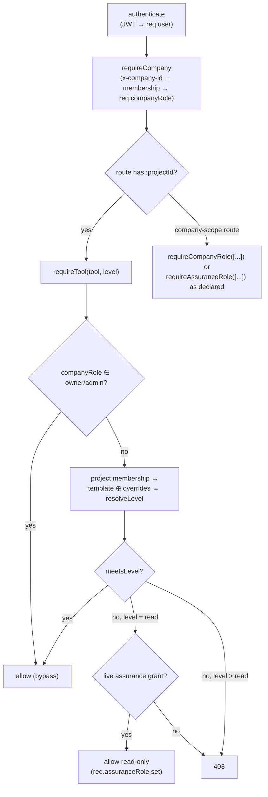

# ConstructOS — Security Model

Engineer-to-engineer reference for authentication, authorization, tenant isolation and
evidentiary integrity. Every claim is grounded in committed code, with file paths. The
honest gap register in §8 is part of the model — a platform whose product is the
trustworthiness of its record cannot afford flattering documentation.

---

## 1. Authentication

Implemented in `apps/api/src/plugins/auth.ts` (verification) and
`apps/api/src/modules/identity/index.ts` (credential lifecycle). Config in
`apps/api/src/config.ts`.

### 1.1 Passwords

- Hashed with **bcrypt, cost factor 10** (`bcryptjs`, `modules/identity/index.ts`
  `POST /auth/register`). Plaintext is never persisted.
- Policy: 8–128 chars enforced by zod (`registerSchema`). No complexity rules, no breach-list
  check yet (see §8).
- Login compares with `bcrypt.compare` and returns a uniform `401 Invalid credentials` for
  unknown email, wrong password and deactivated account alike — no account enumeration via
  the login route. (The register route does reveal whether an email exists via `409`; see §8.)

### 1.2 Access tokens

- **JWT, HS256** via `jose` (`signAccessToken` in `plugins/auth.ts`), symmetric secret from
  `AUTH_SECRET`, subject = user id, default TTL **1 hour**
  (`ACCESS_TOKEN_TTL_SECONDS`, `config.ts`).
- `authenticate` verifies the signature **and re-loads the user row on every request**,
  rejecting unknown or `isActive = false` users — deactivation takes effect on the next
  request, not at token expiry. What it cannot do is revoke a specific stolen token before
  its 1-hour expiry (no jti denylist yet; see §8).

### 1.3 Refresh tokens (rotation)

`modules/identity/index.ts`, table `refresh_tokens`
(`packages/db/src/schema/identity.ts`):

- Opaque random value (two concatenated 21-char nanoids, ≈ 240 bits) — **stored only as its
  SHA-256 hash** (`tokenHash`), so a database read does not yield usable tokens.
- Default TTL 30 days (`REFRESH_TOKEN_TTL_DAYS`).
- **Rotated on every `POST /auth/refresh`**: the presented token is looked up by hash,
  checked for `revokedAt`/`expiresAt`, revoked, and a fresh pair issued. `POST /auth/logout`
  revokes by hash.
- Not yet implemented: reuse detection (a replayed already-rotated token should revoke the
  whole family), device binding, per-session listing. See §8.

### 1.4 Security event log

Every register / login success / login failure / logout writes an `auth_events` row with
`ip` and `userAgent` (`modules/identity/index.ts`; spec Vol I #26). Exposed to company
owners/admins at `GET /api/v1/company/auth-events` (`modules/admin/index.ts`). This is an
operational log in a normal table — the tamper-evident record is the ledger (§5), which
auth events do not currently flow into.

---

## 2. Authorization — the three-layer RBAC model

Defined in `packages/shared/src/permissions.ts`, enforced in `apps/api/src/plugins/auth.ts`,
persisted in `packages/db/src/schema/identity.ts`.

### 2.1 Layer 1 — company roles

`owner | admin | member | guest` (`COMPANY_ROLES`), one per `(companyId, userId)` in
`company_memberships`. Owner/admin: full bypass of tool-level checks inside their tenant
(`requireTool`, `plugins/auth.ts`) plus access to `requireCompanyRole(["owner","admin"])`
routes — permission templates, assurance grants, auth-events (`modules/admin/index.ts`).
`guest` is an ordinary member for tool resolution but is explicitly barred from reviewing AI
proposals (`gateReviewer`, `modules/ai/index.ts`).

### 2.2 Layer 2 — per-tool permission levels

`none < read < standard < admin` (`PERMISSION_LEVELS`, ordered by `meetsLevel`) over the 21
tools in `TOOLS` (directory, projects, documents, drawings, specifications, bim, twin, rfis,
submittals, daily_logs, punch, photos, meetings, workflow, budget, commitments,
change_management, invoicing, assurance, ai, admin).

Resolution (`resolveLevel`): per-user `overrides` on the `project_memberships` row beat the
membership's template (`permission_templates` row, falling back to the shared
`BUILTIN_PERMISSION_TEMPLATES`), which beats `none`. Built-in templates seeded into every new
tenant (`seedCompanyDefaults`, `modules/identity/index.ts`):

| Template | Shape (from `permissions.ts`) |
|---|---|
| `project_admin` | admin on everything |
| `project_manager` | standard everywhere; admin on workflow/rfis/submittals/daily_logs/punch/meetings; **none on admin & assurance** |
| `field_engineer` | read baseline; standard on rfis/daily_logs/punch/photos/documents; none on financial tools, admin, assurance |
| `subcontractor` | none baseline; read drawings/specs/documents; standard on rfis/submittals/daily_logs/punch/photos |
| `owner_stakeholder` | read everywhere incl. assurance & ai; none on admin |
| `read_only` | read everywhere; none on admin & assurance |

Note the deliberate default: **operational project managers get `none` on the assurance
tool.** Visibility into the assurance layer is granted, not assumed.

### 2.3 Layer 3 — assurance roles (segregation of duties)

`integrity_reviewer | auditor | regulator` (`ASSURANCE_ROLES`), granted via
`assurance_grants` rows — tenant-wide (`projectId` null) or per-project, optionally
**time-boxed** via `expiresAt` (the regulator pattern). Grants are managed only by company
owners/admins (`modules/admin/index.ts`) and every check filters expired grants
(`requireAssuranceRole` and `holdsAssuranceRole` in `modules/assurance/index.ts`).

Effect on operational tools: an unexpired grant satisfies any `requireTool(…, "read")` check
(`plugins/auth.ts`) — **read-all, change-nothing**. It never satisfies `standard` or `admin`.

### 2.4 Segregation-of-duties rules, as enforced

| Rule | Enforcement point |
|---|---|
| **Signal disposition requires `integrity_reviewer`** — operational owners/admins must not clear signals about their own records. Company role gives no bypass: the route uses `requireAssuranceRole`, not `requireTool`. | `PATCH /signals/:signalId/disposition`, `modules/assurance/index.ts` |
| Reconciliation disposition requires `integrity_reviewer` or `auditor` | `PATCH /reconciliations/:reconciliationId/disposition`, same file |
| **Assertion/evidence separation** (spec Vol III §4 design rule): creating a reconciliation whose evidence was *entirely* submitted by the assertion's claimant is `403 evidence not independent of claimant`; only a caller holding `integrity_reviewer` may knowingly proceed, and the creation is ledgered with full payload | `POST /projects/:projectId/reconciliations` |
| Self-certification is recorded, not hidden: satisfying an obligation with evidence the caller submitted writes `selfCertified: true` into the ledger payload | obligation `/satisfy` route, same file |
| Detector runs are restricted to assurance-role holders or company owner/admin | `POST /projects/:projectId/detectors/run` |
| AI proposals require a human with the *target tool's* `standard` permission to apply — approving an AI-drafted daily log needs the same right as writing one | `gateReviewer`, `modules/ai/index.ts` |
| Evidence records always carry `submittedBy`; assertions always carry `claimantId` — the separation is checkable after the fact even where not blocked | `packages/db/src/schema/assurance.ts` |

Residual weakness stated plainly: a company **owner/admin can hold operational admin and be
granted an assurance role by another admin** — the platform does not yet forbid overlapping
grants, and evidence/assertions still arrive through the same API pathway (independent
ingestion channels are Tier-1 roadmap work, `docs/roadmap.md`). The rules above make abuse
detectable and attributable, not impossible.

---

## 3. Tenant isolation

- Tenant = `companies` row. Tenant context is an explicit `x-company-id` header checked
  against `company_memberships` on every request (`requireCompany`) — never inferred from the
  JWT, so a stolen token for user X yields nothing in companies X does not belong to.
- **Convention: every query on tenant-owned tables filters by `companyId`** (and `projectId`
  where applicable, which `requireTool` has already proven belongs to the tenant before the
  handler runs). Records are never fetched by id alone. This is a code-review invariant, not
  a database guarantee — there is **no row-level security** in Postgres (§8).
- Child tables reached only through a tenant-checked parent (`file_versions`,
  `workflow_step_instances`, `tag_assignments`, …) rely on the parent lookup being scoped.
- Storage: object keys are prefixed `companyId/` and `keyToPath` rejects traversal outside
  the storage root (`apps/api/src/lib/storage.ts`), so blobs are physically partitioned per
  tenant.
- Ledger: one hash chain per company (`ledger_entries.companyId` + `prevHash`), so exports
  and verification never mix tenants.

---

## 4. Storage content-addressing

`apps/api/src/lib/storage.ts` (spec Domain S #862):

- Objects are stored at `<STORAGE_DIR>/<companyId>/<sha256[0:2]>/<sha256>`. The address *is*
  the content hash: identical payloads dedupe, and a stored object cannot be silently
  replaced without its path ceasing to match its content.
- The hash is computed server-side at ingest and recorded on the `files` row (`sha256`,
  `packages/db/src/schema/documents.ts`) and per version in `file_versions` — the anchor for
  later verification and for `evidence.contentHash`.
- Retrieval does not currently re-hash and compare (verification-on-retrieval is a gap, §8).
- Local disk, single node, unencrypted at rest. The `StorageService` interface is narrow by
  design so an S3/GCS/Azure driver (with SSE) can replace it without touching call sites.

---

## 5. Evidentiary integrity — threat model

The asset under attack is the trustworthiness of the record: the per-company hash chain
(`packages/ledger/src/chain.ts`, persisted via `apps/api/src/lib/ledger.ts` into
`ledger_entries`) plus content-addressed evidence (§4). Verification is
`GET /api/v1/ledger/verify` (`modules/assurance/index.ts`), which itself appends an `access`
entry — verifying the record is part of the record.

| Threat | What the design does | Detected? |
|---|---|---|
| **Post-hoc edit** of a historical ledger row (change actor, action, object, payload hash or timestamp) | `entryHash` covers every field plus `prevHash`; editing entry *k* invalidates entries *k…n*. `verifyChain` reports the first broken index. | Yes — chain break (spec #863, #866) |
| **Edit of an operational row** (e.g. rewrite an RFI answer) without a matching ledger entry | The current state no longer matches the last ledgered `payloadHash` for that `(objectType, objectId)`. Detectable by recomputing `hashPayload` over the row — a comparison job is roadmap, the data to do it exists today. | Partially — evidence exists, automated diffing does not |
| **Backdating** a record | The ledger's `at` is server-assigned at append time and covered by `entryHash`; `seq` (bigserial) gives a total insert order per company. A record claiming an early date but ledgered late is visible on inspection. | Yes, relative to server time — but see "trusted time" below |
| **Deletion** of a ledger entry | The successor's `prevHash` no longer matches; `seq` gaps corroborate. | Yes — chain break |
| **Deletion of an operational record** | Handlers append `action: "delete"` entries (module convention); the ledger retains `payloadHash` (and full payload where `storePayload` was set). | Yes, when the convention is followed — there is no DB trigger backstop (§8) |
| **Truncating the chain tail** (drop the last *k* entries) | Internally consistent — a truncated chain still verifies. Requires an externally held head hash or Merkle root to detect. | **No — known gap** (escrow/anchoring, spec #860–861, #874, not implemented) |
| **Full-chain rewrite by a database administrator** (recompute every hash) | Computationally trivial for an insider with DB write access; only an external anchor defeats it. | **No — same gap** |
| **Evidence file substitution** | Content-addressed path + recorded `sha256` / `evidence.contentHash`; a swapped payload no longer hashes to its address. Merkle evidence packs (`POST /projects/:projectId/evidence-packs`) commit a whole set under one root with per-leaf inclusion proofs — the root is the escrow-able artifact. | Yes, given the hash is checked at read time (not yet automatic, §8) |
| **Self-certified evidence** (claimant authors both sides) | Blocked at reconciliation creation unless an `integrity_reviewer` overrides; recorded (`submittedBy`, `selfCertified`) elsewhere. `independenceScore` quantifies source independence. | Yes — flagged, and blocked in the reconciliation path |
| **Clock manipulation on the API host** | `at` comes from `new Date()` on the app server; no trusted time source (spec #864). | No — gap |

What the chain proves: *the recorded sequence of state changes has not been altered since it
was written, and each change is bound to an actor, an object and a payload digest.* What it
does **not** prove: that a payload was true when written (that is the reconciliation
engine's job), or that the whole database was not replaced wholesale by its operator
(that requires external anchoring — the Merkle pack root is the committed foundation for it).

---

## 6. AI-surface security

- Disabled by default: without `ANTHROPIC_API_KEY`, every AI route returns
  `503 AiDisabled` (`modules/ai/service.ts`) — no silent fallback, nothing leaves the host.
- No autonomous mutation: agents write proposals to `ai_review_queue`; applying one re-runs
  the target tool's permission gate against the human reviewer (`gateReviewer`,
  `modules/ai/index.ts`) and flows through the normal ledger append.
- Full audit: every invocation — including failures and refusals — is an `ai_runs` row with
  requester, input record provenance, prompt, output, citations and token counts
  (spec Domain X #1019–1021). Prompts and outputs may contain project data; `ai_runs` is
  tenant-scoped like any other table.

---

## 7. Secrets & configuration

- All configuration is environment-driven through a zod schema (`apps/api/src/config.ts`);
  unknown shapes fail at boot, nothing secret is committed.
- `AUTH_SECRET` (min 16 chars) **defaults to a dev-only value** — deployments must set it;
  there is no production guard refusing the default yet (§8).
- `ANTHROPIC_API_KEY` is optional and only ever read server-side.
- The global error handler hides 5xx details when `NODE_ENV=production` (`app.ts`).
- `docker-compose.yml` carries throwaway local Postgres credentials only.

---

## 8. Known gaps — TODO register

Ordered roughly by risk. "Spec" references are `docs/master-specification.md`.

| # | Gap | Notes / spec ref |
|---|---|---|
| 1 | **No rate limiting or lockout** on `/auth/login` or anywhere else — online credential stuffing is unimpeded | add `@fastify/rate-limit` + progressive lockout; auth_events already records failures |
| 2 | **No MFA** | Vol I #22 |
| 3 | **No external ledger anchoring/escrow** — tail-truncation and full-rewrite by a DB insider are undetectable | Domain S #860–861, #874; Merkle pack roots exist, publishing them does not |
| 4 | **No trusted timestamping** — ledger `at` is app-server clock | Domain S #864 |
| 5 | **No SSO (SAML) / SCIM** — blocks enterprise tenants | Vol I #20–21 |
| 6 | Access-token revocation only via 1h expiry (no jti denylist); refresh-token **reuse detection** absent | §1.2–1.3 |
| 7 | **No DB-level row security** — tenant isolation is a code convention; one missed `companyId` filter is a cross-tenant leak | add Postgres RLS keyed on a per-request setting as defense-in-depth |
| 8 | CORS `origin: true` and open registration — fine for dev, must be tightened per deployment | `app.ts` |
| 9 | Dev-default `AUTH_SECRET` accepted even in production | add a boot-time refusal |
| 10 | Storage: single node, unencrypted at rest, no hash re-verification on read, no malware scanning of uploads | §4; Domain S #862 (retrieval half) |
| 11 | Ledger coverage relies on module convention (no DB trigger writes entries for out-of-band changes); no automated drift job comparing row state to last `payloadHash` | §5 |
| 12 | Overlapping operational + assurance roles for the same user are not forbidden | §2.4 |
| 13 | Register route reveals email existence (409); no email verification flow | §1.1 |
| 14 | No IP allowlisting, session timeout policy, or password policy configuration | Vol I #23–25 |
| 15 | Read access is mostly unlogged (exceptions: `file_access_log`, ledger `access` entries); regulator access is read-all rather than record-scoped | Domain A #92 wants scoped regulator portals |
| 16 | No field-level visibility control on financial data (tools are all-or-nothing per level) | Vol I #18 |
| 17 | Refresh tokens and JWTs are bearer credentials over whatever TLS the deployment provides — the app itself does not enforce HTTPS/HSTS | reverse-proxy responsibility, must be documented per deployment |

None of these are silent: this register, `docs/roadmap.md` and the ADRs are the paper trail
that they are known, scoped and sequenced.
