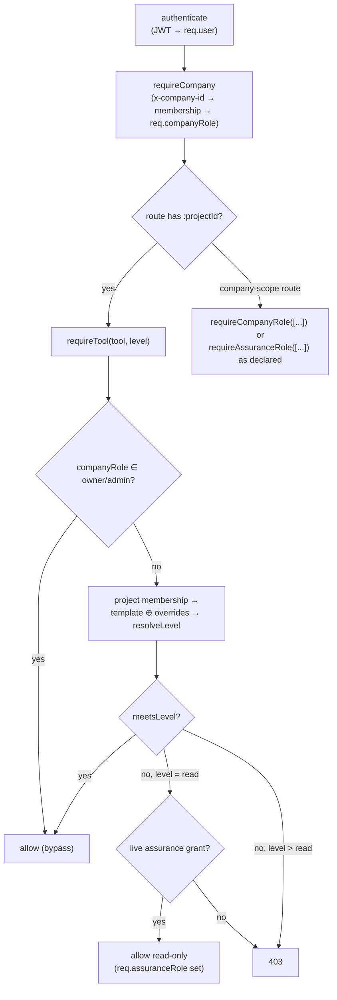

# ConstructOS — Security Model

Engineer-to-engineer reference for authentication, authorization, tenant isolation and
evidentiary integrity. Every claim is grounded in committed code, with file paths. The
honest gap register in §8 is part of the model — a platform whose product is the
trustworthiness of its record cannot afford flattering documentation.

---

## 1. Authentication

Implemented in `apps/api/src/plugins/auth.ts` (verification) and
`apps/api/src/modules/identity/index.ts` (credential lifecycle). Config in
`apps/api/src/config.ts`.

### 1.1 Passwords

- Hashed with **bcrypt**, cost from `BCRYPT_COST` — floored at 12 everywhere except
  `NODE_ENV=test`, where it is capped at 10 so a suite is not a CPU burn
  (`passwordHashCost`, `modules/account/password.ts`) — and rehashed transparently on the next successful
  sign-in when the stored cost is below the current one (`completeLogin`,
  `modules/account/login.ts`). Plaintext is never persisted.
- Policy is no longer a zod length check: `modules/account/policy.ts` resolves the tenant
  policy (minimum length ≥ 12, optional complexity, maximum age, history depth) and
  `assessPasswordWithPolicy` applies it at registration, change, reset and invitation
  acceptance. Reuse is refused against `password_history` (hashes only). See §1.9.
  Still absent: a breach-list check (see §8).
- Login compares with `bcrypt.compare` and returns a uniform `401 Invalid credentials` for
  unknown email, wrong password and deactivated account alike — no account enumeration via
  the login route. (The register route does reveal whether an email exists via `409`; see §8.)

### 1.2 Access tokens

- **JWT, HS256** via `jose` (`signAccessToken` in `plugins/auth.ts`), symmetric secret from
  `AUTH_SECRET`, subject = user id, default TTL **1 hour**
  (`ACCESS_TOKEN_TTL_SECONDS`, `config.ts`).
- `authenticate` verifies the signature **and re-loads the user row on every request**,
  rejecting unknown or `isActive = false` users — deactivation takes effect on the next
  request, not at token expiry. What it cannot do is revoke a specific stolen token before
  its 1-hour expiry (no jti denylist yet; see §8).

### 1.3 Refresh tokens (rotation)

`modules/identity/index.ts`, table `refresh_tokens`
(`packages/db/src/schema/identity.ts`):

- Opaque random value (two concatenated 21-char nanoids, ≈ 240 bits) — **stored only as its
  SHA-256 hash** (`tokenHash`), so a database read does not yield usable tokens.
- Default TTL 30 days (`REFRESH_TOKEN_TTL_DAYS`).
- **Rotated on every `POST /auth/refresh`**: the presented token is looked up by hash,
  checked for `revokedAt`/`expiresAt`, revoked, and a fresh pair issued. `POST /auth/logout`
  revokes by hash.
- Not yet implemented: reuse detection (a replayed already-rotated token should revoke the
  whole family), device binding, per-session listing. See §8.

### 1.4 Security event log

Every register / login success / login failure / logout writes an `auth_events` row with
`ip` and `userAgent` (`modules/identity/index.ts`; spec Vol I #26). Exposed to company
owners/admins at `GET /api/v1/company/auth-events` (`modules/admin/index.ts`). This is an
operational log in a normal table — the tamper-evident record is the ledger (§5), which
auth events do not currently flow into.

### 1.5 Ingestion API tokens (machine credentials)

`modules/ingestion/index.ts`, table `api_tokens` (`packages/db/src/schema/ingestion.ts`).
The platform's second credential type, added in Phase 6 for machine evidence streams
(turnstile feeds, payroll exports — ADR 0014/0015). Deliberately narrow:

- **Format & storage**: `cok_` + 40 hex chars (160 bits from `randomBytes`). Only the
  **SHA-256** of the token is persisted (`tokenHash`), plus the first 8 characters for
  display (`tokenPrefix`) — a database read yields nothing usable, same discipline as
  refresh tokens (§1.3).
- **Show-once**: the raw token appears exactly once, in the `POST /ingestion/tokens` 201
  response, and never again — every read path strips `tokenHash`, the module writes no
  logs, and the tests grep a live server log for the raw value and the `cok_[0-9a-f]{40}`
  pattern to keep it that way.
- **Dataset scopes, nothing else**: `scopes` names the ingestion datasets the token may
  push to. A token authorizes `POST /ingestion/push/:dataset` and **nothing else on the
  platform** — it is not a user, holds no tool levels, and an out-of-scope dataset is a
  403 before anything is written.
- **Lifecycle**: creation and revocation are company owner/admin acts, both ledgered
  (payload carries the prefix, never the hash). Revocation is immediate — the next push
  is a 401 — as is expiry (`expiresAt`); `lastUsedAt` is stamped on every accepted push.
- **Attribution is honest**: a push authenticates by hash lookup with no JWT and no
  session; the implicit run's `startedBy` is the **token id**, and its ledger entries
  carry `actorId: null` with the token identified in the payload — the record preserves
  that no human session authored these rows (real committed records carry the token
  creator's user id, because the columns demand a user; the run and the ledger carry the
  pathway).

### 1.6 Multi-factor authentication (spec Vol I #22)

TOTP only, and that is a deliberate limit stated rather than hidden:
`MFA_METHODS` lists what the platform can actually verify today, and a factor it cannot
check would be the security equivalent of a fabricated figure. Recovery codes are the
second member, single-use, hashed at rest.

- **A password alone never produces a session** for an account with a confirmed factor.
  It produces a CHALLENGE — a short-lived, MAC-authenticated, purpose-scoped token that
  is not an access token and cannot reach a single authenticated route. Both
  `POST /auth/login` and `POST /auth/mfa/login` speak that one protocol and both redeem
  at `POST /auth/mfa/challenge`.
- **A `pending` enrolment is not a factor.** A seed that has been shown and never proved
  does not satisfy anything; treating it as one would lock out every user who scanned a
  QR code into an app they then deleted.
- **`mfa_satisfied_at` sits on the SESSION**, not the user: clearing a factor authorises
  one device, and a new device must clear it again.
- **Tenant policy** (`mfaRequired`) forces enrolment at the next sign-in for members with
  no factor, and — since this wave — applies to SSO sign-ins too (§1.7).
- **Admin reset** (`POST /company/security/users/:id/mfa/reset`) disables every factor,
  revokes every recovery code and kills every session, because the sessions were
  authorised against the factor being removed.

### 1.7 Single sign-on (OIDC)

`modules/sso`. Per-tenant connections (`identity_providers`), authorization-code flow with
PKCE, id_tokens verified against the provider's published JWKS before any claim is read,
`state` as an opaque server-side lookup key bound to a browser cookie, and a single-use
ticket exchange so a refresh token never travels in a redirect URL.

What this wave changed:

- **The tenant MFA policy now applies to SSO.** Previously `issueSession` wrote
  `mfa_satisfied_at: null` and never consulted the policy or the assertion's `amr`/`acr`,
  so a company that required a second factor still admitted every SSO user without one —
  the policy and the coverage figure next to it were cosmetic for exactly the tenants
  most likely to have SSO. The callback now returns the same challenge envelope a
  password sign-in returns, unless the connection is explicitly configured to perform MFA
  itself (`idpPerformsMfa`) **and** the assertion carries one of the administrator's
  accepted `mfaAmrValues`. Trusting an IdP's word about MFA is a decision an
  administrator takes, never a default.
- **`defaultTemplateKey` is applied.** It used to be resolved, written into the ledger
  payload and applied to nothing, so a JIT-provisioned member held a company membership
  and could not open a single project. The connection now names the projects
  (`provisionProjectIds`, each validated to belong to the same company) and provisioning
  creates the project memberships.
- **Redirect-mode errors no longer leak internals.** The callback used to put
  `err.message` into the redirect URL for any thrown error — browser history, the Referer
  header of the next request, every proxy log in between — bypassing the production 5xx
  masking. Only an `AppError` below 500 travels; anything else is logged server-side with
  a reference the user is asked to quote.
- **In-flight state is durable.** The flow/ticket store was a process-memory map whose
  own header said a multi-replica deployment needed sticky routing or a shared store.
  With `DATABASE_URL` set it is now `sso_flows` / `sso_tickets`, keyed on
  `sha256(state)`, single-use by `DELETE … RETURNING`, swept lazily.
- **SAML is refused, not half-built.** `POST /identity-providers` accepts `kind: "saml"`
  as configuration and every flow route answers 501 with the reason. Implementing it
  needs a reviewed XML-DSIG dependency with exclusive canonicalisation; a hand-rolled
  signature check over XML is a well-known way to build an authentication bypass.

### 1.8 SCIM 2.0 provisioning (spec Vol I #21)

`/api/v1/scim/v2`. Per-tenant bearer tokens, hashed at rest exactly like every other
credential here and shown once. The token authenticates a DIRECTORY, not a person: it
carries no user id, and its authority is exactly "manage members of this one company", so
every handler filters on the token's company rather than on anything in the request.

Deprovisioning is real: `active: false` removes the company membership, revokes the
sessions opened in that company, and deactivates the account platform-wide when it belongs
to no other company. Groups are the four company roles; per-project permission templates
are not exposed because SCIM has no concept of a project, and the discovery document says
so rather than leaving an integrator to find out. The `owner` role is never removed by a
directory.

### 1.9 The tenant security policy (spec Vol I #23, #24, #25)

`company_security_policies`, one row per tenant, set at `PUT /company/security-policy` by
an owner or admin, ledgered and written to the security trail.

**The rule that is not obvious: the strictest policy across a user's companies wins.** A
session is an ACCOUNT-level object — one token reads data from every tenant the holder
belongs to — so the policy governing it must be the strictest of the tenants it can reach.
Anything else means a member of a lax tenant holds a long-lived, short-password session
and then reads a strict tenant's records through it. Half the folds in
`resolvePolicies` are minima (timeouts, attempt counts) and half are maxima (length,
history depth, lockout duration); each direction is unit-tested, because getting one
backwards silently weakens every multi-company user.

The **IP allowlist is the exception** and has to be: intersecting several tenants'
allowlists would produce an empty set and lock the user out of all of them. It is
evaluated per tenant, and a sign-in is refused only when *every* company of that account
refuses the address — one `login_blocked_ip` row rather than forty subsequent 403s.
Three modes (`off`, `monitor`, `enforce`), a break-glass exemption list, and a refusal to
enable `enforce` from an address the new list would itself refuse. An empty list in
`enforce` mode is treated as `off`, because interpreting it literally is a tenant nobody
can reach including the administrator who could fix it.

Password history (`password_history`) retains hashes only, at the cost they were written
at; a reuse check is N bcrypt comparisons, which is why N is a tenant setting with a hard
ceiling of 24 rather than "all of them".

### 1.10 Security event webhooks

A tenant's `auth_security_events` can be pushed to a SIEM. Deliberately separate from the
integrations webhooks: that subscription carries ledger events about the works and its
subscribers are line-of-business systems, which have no business receiving a failed-login
stream. The two share the wire format, the HMAC signing scheme and the SSRF policy, so one
integrator implementation verifies both.

Nothing that could be replayed ever leaves: the payload is built from the trail row, and
`auth_security_events.metadata` is forbidden from holding a password, a raw token, a TOTP
code or a recovery code in the first place.

An event with **no company** — a failed login against an address that belongs to nobody —
reaches no endpoint, because there is no tenant whose webhook it is. Those are exactly the
rows an intrusion investigation needs most; they are retained platform-wide for the
operator, and the tenant-facing audit says so rather than letting an auditor conclude
there were none.

### 1.11 MFA challenges are single-use and revocable (`mfa_challenges`)

The challenge token is a MAC (`mfachal_v1.<claims>.<mac>`), purpose-separated from the JWT
key so it cannot be presented as a bearer token; the CHALLENGE it names is a row.

Consumption is an **upsert on the token's own `jti`**, not a lookup. That shape is the
whole design: three modules mint challenges — `mfa` (`/auth/mfa/login`), `sso` (an IdP
sign-in into a tenant that requires a second factor) and `identity` (`/auth/login`) — and
requiring every minter to register first would have made a cross-module edit a
precondition of every sign-in. So the first exchange either flips a live row or inserts an
already-consumed one, and any later exchange finds a consumed row and is refused. A
challenge minted by a module that never registered is single-use exactly like one that
did.

Registration at mint time adds what the upsert cannot: a challenge an administrator can
revoke in flight. `POST /company/security/users/:id/mfa/reset` cuts them, because a
challenge minted a minute before the reset is authority issued on the strength of the
factor being removed.

The store **fails open on an infrastructure error and closed on a replay**: a database
that cannot be read is already an outage, and turning it into "nobody with a second factor
can sign in" adds nothing to anyone's safety. The exposure under that failure is exactly
the one the stateless design always had.

Confirming a factor now also **tells the account holder** (`renderMfaEnrolled`, which
existed and was never dispatched): the one change that most needs to reach a human is
"a second factor now guards your account, and if it was not you, someone else holds your
password".

### 1.12 Data lifecycle for the authentication record (§0.2 #45, #46, #47)

| Log | Holds | Past retention |
|---|---|---|
| `auth_security_events` | address, IP, user agent, kind, outcome, time | **pseudonymised** — address/IP/agent cleared, countable facts kept |
| `email_dispatches` | recipient, subject, body preview | **deleted** — a preview of a message nobody can identify is not evidence |

Three rules, in the order they override each other:

1. **A legal hold beats a retention period**, always, and the sweep says it skipped the
   tenant rather than reporting zero rows.
2. **A tenant that has chosen nothing is not swept.** null means keep, which is what the
   platform did before the policy existed.
3. Otherwise the retention age applies, with a floor of 30 days — shorter than that and a
   tenant would delete the record of the incident the audit exists to investigate.

`GET /account/export` (spec #45) returns everything the authentication layer holds about
the caller and **no credential**: no password hash, no TOTP seed, no recovery-code hash,
no session or refresh token. An export is a file that ends up in a downloads folder, so
putting a credential in it would turn a transparency feature into a second copy of the
thing this platform hashes everything to avoid holding. Every export is ledgered as an
`access` in each company the caller belongs to.

---

## 2. Authorization — the three-layer RBAC model

Defined in `packages/shared/src/permissions.ts`, enforced in `apps/api/src/plugins/auth.ts`,
persisted in `packages/db/src/schema/identity.ts`.

### 2.1 Layer 1 — company roles

`owner | admin | member | guest` (`COMPANY_ROLES`), one per `(companyId, userId)` in
`company_memberships`. Owner/admin: full bypass of tool-level checks inside their tenant
(`requireTool`, `plugins/auth.ts`) plus access to `requireCompanyRole(["owner","admin"])`
routes — permission templates, assurance grants, auth-events (`modules/admin/index.ts`).
`guest` is an ordinary member for tool resolution but is explicitly barred from reviewing AI
proposals (`gateReviewer`, `modules/ai/index.ts`).

### 2.2 Layer 2 — per-tool permission levels

`none < read < standard < admin` (`PERMISSION_LEVELS`, ordered by `meetsLevel`) over the 37
tools in `TOOLS` (directory, projects, documents, drawings, specifications, bim, twin, rfis,
submittals, daily_logs, punch, photos, meetings, workflow, budget, commitments,
change_management, invoicing, commercial, contracts, schedule, forensics, payments, risk,
governance, finance, disputes, **land, workforce, esg, jurisdiction, analytics, ingestion,
benchmarks**, assurance, ai, admin). The Phase 3 and Phase 4 tools (risk, governance,
finance, disputes), the five Phase 5 tools (land, workforce, esg, jurisdiction, analytics)
and the two Phase 6 tools (ingestion, benchmarks) inherit the built-in template
baselines via the `all(…)` spreads in `permissions.ts` — e.g. `project_manager` gets
`standard`, `subcontractor` gets `none` — with no per-tool carve-outs added. That default is
worth stating out loud now that the tool list includes safeguard data: **a subcontractor
template gets `none` on `workforce` and `land`, and a `read_only`/`owner_stakeholder`
template gets `read` on both** — so worker personal data and PAP vulnerability flags are
visible to every read-all template on the project. There is no field-level masking (gaps 15
and 18); tenants that need tighter handling must build it with per-user `overrides`.
Two Phase 6 routes deliberately sit above their tool's levels: the ingestion module's
mutating routes gate on **company owner/admin**, not `ingestion` levels (bulk migration
and machine credentials are tenant-administration acts), and benchmark *contribution*
requires `benchmarks` **admin** (§2.4).

Resolution (`resolveLevel`): per-user `overrides` on the `project_memberships` row beat the
membership's template (`permission_templates` row, falling back to the shared
`BUILTIN_PERMISSION_TEMPLATES`), which beats `none`. Built-in templates seeded into every new
tenant (`seedCompanyDefaults`, `modules/identity/index.ts`):

| Template | Shape (from `permissions.ts`) |
|---|---|
| `project_admin` | admin on everything |
| `project_manager` | standard everywhere; admin on workflow/rfis/submittals/daily_logs/punch/meetings; **none on admin & assurance** |
| `field_engineer` | read baseline; standard on rfis/daily_logs/punch/photos/documents; none on financial tools, admin, assurance |
| `subcontractor` | none baseline; read drawings/specs/documents; standard on rfis/submittals/daily_logs/punch/photos |
| `owner_stakeholder` | read everywhere incl. assurance & ai; none on admin |
| `read_only` | read everywhere; none on admin & assurance |

Note the deliberate default: **operational project managers get `none` on the assurance
tool.** Visibility into the assurance layer is granted, not assumed.

### 2.3 Layer 3 — assurance roles (segregation of duties)

`integrity_reviewer | auditor | regulator` (`ASSURANCE_ROLES`), granted via
`assurance_grants` rows — tenant-wide (`projectId` null) or per-project, optionally
**time-boxed** via `expiresAt` (the regulator pattern). Grants are managed only by company
owners/admins (`modules/admin/index.ts`) and every check filters expired grants
(`requireAssuranceRole` and `holdsAssuranceRole` in `modules/assurance/index.ts`).

Effect on operational tools: an unexpired grant satisfies any `requireTool(…, "read")` check
(`plugins/auth.ts`) — **read-all, change-nothing**. It never satisfies `standard` or `admin`.

### 2.4 Segregation-of-duties rules, as enforced

| Rule | Enforcement point |
|---|---|
| **Signal disposition requires `integrity_reviewer`** — operational owners/admins must not clear signals about their own records. Company role gives no bypass: the route uses `requireAssuranceRole`, not `requireTool`. | `PATCH /signals/:signalId/disposition`, `modules/assurance/index.ts` |
| Reconciliation disposition requires `integrity_reviewer` or `auditor` | `PATCH /reconciliations/:reconciliationId/disposition`, same file |
| **Assertion/evidence separation** (spec Vol III §4 design rule): creating a reconciliation whose evidence was *entirely* submitted by the assertion's claimant is `403 evidence not independent of claimant`; only a caller holding `integrity_reviewer` may knowingly proceed, and the creation is ledgered with full payload | `POST /projects/:projectId/reconciliations` |
| Self-certification is recorded, not hidden: satisfying an obligation with evidence the caller submitted writes `selfCertified: true` into the ledger payload | obligation `/satisfy` route, same file |
| Detector runs are restricted to assurance-role holders or company owner/admin | `POST /projects/:projectId/detectors/run` |
| AI proposals require a human with the *target tool's* `standard` permission to apply — approving an AI-drafted daily log needs the same right as writing one | `gateReviewer`, `modules/ai/index.ts` |
| **Payment certification requires a different human than the application's submitter** — `POST /valuations/:valuationId/certify` returns `403 The certifier must not be the valuation's submitter` when the caller is `valuations.submittedBy`. Level separation stacks on identity separation: submitting needs `commercial` `standard`, certifying needs `commercial` **admin**. The certificate persists the variance from the application with a reason (spec B#180), and the certified value is simultaneously written to the assurance layer as a `cost` Assertion claimed by the *certifier* — so certification is itself a reconcilable claim, not a settled fact (see `docs/adr/0008-certification-independence.md`) | `modules/commercial/valuations.ts`, certify route |
| **EOT assessment independence** — an extension-of-time claim cannot be moved to `assessed` by the user who raised it (`403 An EOT claim cannot be assessed by the user who raised it`); `assessedBy`/`assessedAt` are stamped on the row and the transition is ledgered with the days awarded | `modules/contracts/index.ts`, EOT status route |
| **Time-bar obligations cannot be quietly rewritten** — a contract event under a time-barred clause materializes an assurance `obligations` row at creation (deadline + `warnDaysBefore`). Serving notice satisfies an *open* obligation only; once the sweep has marked an event `time_barred` and breached its obligation, late service raises a `time_bar_breach_risk` signal and leaves the breach standing — the register records what happened, not what the operator wishes had happened | `sweepTimeBars` + serve-notice route, `modules/contracts/index.ts` |
| **Forensic claim assessment independence** — a delay/disruption claim cannot be moved to `assessed` by the user who created it (`403 A claim cannot be assessed by the user who created it`); `assessedBy` is stamped, the assessed days/amount are ledgered with the transition, and the claim's cause-effect-entitlement-quantum chain and supporting event set are frozen once it leaves `draft` — the narrative that was submitted is the narrative that gets assessed. Same identity-level pattern as EOT assessment and payment certification (ADR 0008) | `modules/forensics/index.ts`, claim status route |
| **Payment response authority is grounds-based and time-boxed** — a pay-less notice for less than the claimed amount without stated reasons is a 400 (statutory ground-stating, spec F#365); a response served after the statutory deadline is recorded with `late = 1`, **rescues no status** (a deemed claim stays deemed), breaches the response obligation and raises a high `late_payment_response` signal; served claims are immutable (only drafts can be edited). The payer cannot retroactively construct a compliant response history | `modules/payments/index.ts`, respond route |
| **Deemed-liability signal path** — the same materialization pattern as time bars: serving a payment claim creates an assurance `obligations` row for the statutory response deadline (`warnDaysBefore: 3`), so the payment clock and the obligation register agree on one date. The lazy sweep (`sweepDeemed`, run on every read of the register) flips an unanswered served claim to `deemed` exactly once, breaches the obligation and raises a **critical `payment_deemed_liability` signal** whose explanation embeds the regime's statutory deemed rule. Payment satisfies an *open* obligation only — paying late does not un-breach the register | `sweepDeemed` + serve/respond/mark-paid routes, `modules/payments/index.ts` |
| **Business-case determination independence** — a submitted business case cannot be approved or rejected by its author (`403 Determination independence: the author of a business case cannot decide it`); approval additionally requires a preferred option (an approval that endorses no option is not a decision), the decision is ledgered with the preferred option, and an approved/rejected case is **immutable** — the appraisal a decision was made on cannot be re-shaped afterwards (options and appraisal config are draft-only edits). Same identity-level pattern as certification and EOT/claim assessment (ADR 0008) | `modules/governance/index.ts`, approve/reject + PATCH/options routes |
| **Disbursement approval separation** — a disbursement request cannot be approved by its creator (`403 Separation of duties: a disbursement request cannot be approved by its creator`). Level separation stacks on identity separation: drafting/submitting needs `finance` `standard`, approve/reject need `finance` **admin** — as does waiving a facility condition, which also requires a stated reason and is ledgered with it. Disbursing requires a previously approved request; every transition is ledgered with payload | `modules/finance/index.ts`, approve/reject/waive routes |
| **The conditionality gate is a control, not a convenience** — a disbursement request cannot be *submitted* while any condition precedent on its facility is open **or breached** (409 listing the blocking conditions); the verification snapshot (`{verifiedAt, openConditions[]}`) is persisted on the request whether or not it passed, and **a blocked submission attempt is itself ledgered** (`submit_blocked_by_conditionality`) — circumvention attempts are on the record. Condition satisfaction requires validated assurance evidence ids (never a bare assertion); late satisfaction unblocks the pipeline but a breached obligation stays breached — only an explicit admin-level waiver supersedes it. Headroom is enforced at the same gate: the pipeline may exceed neither the facility's committed amount nor a category limit | `modules/finance/index.ts`, submit route + `sweepOverdueConditions`; ADR 0012 |
| **Contingency drawdown authority is recorded and bounded** — a drawdown exceeding the remaining contingency is refused (409 with the arithmetic); every draw records `approvedBy` and is ledgered with full payload (amount, reason, linked risk, remaining-after); a contingency with recorded drawdowns cannot be deleted; and the draw that takes remaining cover under 20% raises a high `contingency_exhaustion` signal exactly once. Stated plainly: there is **no separate release-approval workflow yet** (spec H#472) — `approvedBy` is the caller, gated only at `risk` `standard`, so drawdown authority is attributable and bounded but not yet two-person | `modules/risk/index.ts`, drawdowns route |
| **Dispute timetables and bundles cannot be quietly rewritten** — overdue timetable steps are breached by the lazy sweep (obligation breached + high `dispute_deadline_missed` signal, exactly once via the step's `breachedAt` marker) and completing a step satisfies an *open* obligation only — a missed deadline stays on the register. A generated hearing bundle is **frozen**: its manifest commits tab order and per-item content hashes under a Merkle root, `/verify` recomputes every hash and the root against today's records (the check is ledgered as an `access` entry), and only a generated bundle can be issued | `modules/disputes/index.ts`, sweep + complete/generate/verify/issue routes |
| **Compensation cannot be asserted, only evidenced** — a land parcel or an affected household is marked compensated **only** through `POST …/parcels/:parcelId/compensate` / `…/affected-persons/:papId/compensate`, which require at least one validated assurance `evidence` id (a bank transaction, a signed receipt, a beneficiary-verified payment record — spec J#554) and ledger the payment with full payload. The plain status route refuses `compensated` outright with a 400 naming the evidenced route, so the control cannot be walked around by editing a field. Same rule, same reason as lender-condition satisfaction (#731): a payment to a displaced household is discharged by pointing at documents | `modules/land/parcels.ts`, `modules/land/paps.ts`, compensate + status routes |
| **Grievance closure is verified with the complainant, not by the operator** (J#573) — `closed_verified` is reachable only through `POST …/grievances/:id/verify-closure` on a `resolved` grievance, and only when `complainantSatisfied` is true. A rejection **reopens** the grievance to `investigating`, nulls `resolvedAt` and ledgers `closure_rejected_reopened` with the rejected resolution text. The severity-driven SLA is an assurance `obligations` row (ADR 0012) that the lazy sweep breaches exactly once with a `grievance_sla_breach` signal; late closure satisfies an *open* obligation only. Anonymous intake is genuinely anonymous: `complainantName`/`complainantContact` are **stripped at intake**, not merely hidden, so they cannot resurface through a later read or a ledger payload | `modules/land/grievances.ts`, intake + resolve/verify-closure routes + `sweepGrievanceSla` |
| **The resettlement cut-off date is an admin act that bounds the entitlement population** (J#564) — declaring `landCutOffDate` requires `land` **admin** and is ledgered with the previous value; thereafter a PAP census dated after the cut-off is a 400 (*"households recorded after the cut-off are encroachment, not project-affected persons"*). This closes the classic compensation-fraud vector on a resettlement programme — inflating the beneficiary list after the boundary is drawn — in code rather than in procedure | `modules/land/paps.ts`, cut-off + PAP create/patch routes |
| **Ghost-worker reconciliation is a payroll control, not a report** (M#669, #677) — the employer's payroll claim (`payroll_entries`) and the site-access record (`site_access_records`) are separate tables with separate write routes, and `POST …/workforce/reconcile` runs a pure engine over both: pay claimed with **zero** evidenced days on site raises a **critical `ghost_worker` signal** valuing the whole gross pay at risk; claimed days beyond 1.15× evidenced days raise `payroll_overclaim`; an implied daily rate below 0.95× the worker's agreed rate raises `wage_underpayment` with the shortfall owed *to* the worker. Signals are idempotent per `(detector, worker, period)`, the run is ledgered with its totals, and the GET twin replays the identical engine while writing nothing. Neither stream can be derived from the other — there is no route that infers attendance from payroll or payroll from attendance, and adding one would defeat the control (`docs/adr/0014-independent-evidence-streams.md`) | `modules/workforce/index.ts` reconcile routes + `modules/workforce/reconcile.ts` |
| **Child labour is a blocked write that still leaves a record** (M#670) — enrolling or patching a worker whose date of birth puts them under 18 (ILO C138, `MINIMUM_WORKING_AGE`) is refused, and the **refused attempt raises a critical `underage_worker_blocked` signal first**, so the attempt is on the register even though the row never lands. Labour-rights indicator severity is likewise derived from the **indicator** (`CRITICAL_LABOUR_INDICATORS`: passport retention, debt bondage, underage, movement restriction), never from who reported it — a subcontractor cannot downgrade a passport-retention finding by filing it themselves. Labour-audit findings with a CAP due date materialize assurance `obligations` (ADR 0012) and the sweep breaches overdue plans once (`labour_cap_overdue`) | `modules/workforce/index.ts`, worker create/patch, risk-flag and audit-report routes |
| **The analytics builder is an injection control by construction** — a report definition is stored user input describing a query, and SQL identifiers cannot be parameterized, so **no identifier is ever taken from the user**: dataset, columns, filter fields, group-by, aggregation fields and sort are keys looked up in a code registry (via `Object.hasOwn`, so prototype-chain keys like `__proto__`/`constructor` do not resolve), an unresolved key is a 400 that echoes the key back without using it, aggregation aliases are pattern-locked to `[A-Za-z][A-Za-z0-9_]{0,40}`, and filter values are type-coerced (enums checked against their vocabulary, `in` capped at 200) and bound as parameters. **Scope is appended by the executor from the request, first, with the definition's own filters ANDed beneath it** — a stored definition naming another tenant returns nothing rather than escaping the tenant, and a company-wide run by a non-admin is narrowed to `reachableProjectIds` (memberships + grants), with an empty reach rendered as `false` rather than "everything" (spec #751). Calculated columns (#734) are deliberately unsupported for the same reason. Rationale and trade-off: `docs/adr/0013-whitelisted-report-builder.md` | `modules/analytics/datasets.ts` (`lookupDataset`/`lookupColumn`/`resolveReport`/`executeReport`), `modules/analytics/index.ts` (`reachableProjectIds`, `assertProjectReadable`) |
| **Permit and consent clocks cannot be quietly reset** — a permit's statutory determination period materializes an assurance `obligations` row at application, kept in step when the application date or period is edited; a determination past its due date breaches that obligation and raises `permit_determination_overdue`, and a granted permit past `expiresAt` is flipped to `expired` with a high `permit_expired` signal by the same lazy sweep. FX rates are an append-only dated register attributed to a source (`contractual` / `central_bank` / `market` / `manual`) and unique per `(company, pair, date, source)`, and every conversion reports the path it took and the quote dates behind it — a rate-of-exchange dispute (K#598) is won on the audit trail, not on the number | `modules/jurisdiction/index.ts` (`sweepPermits`), `modules/jurisdiction/fx.ts` (`resolveRate`) |
| **Machine pushes are scoped, staged and never impersonate a person** — an ingestion push authenticates by the SHA-256 of a dataset-scoped token (§1.5), is refused with 403 for any dataset outside the token's scopes before anything is written, lands in staging and passes the same validation as the migration wizard, and is recorded as authored by the *token*: run `startedBy` is the token id and the ledger entries carry `actorId: null` with the token identified in the payload. This is ADR 0014's pathway separation made concrete — payroll filed by a user session and site access pushed by a token are distinguishable in the record forever. Nothing external writes a real record directly: staged rows cross into real tables only through an explicit, transactional, ledgered commit with per-row provenance, and a re-presented batch (`externalId` already committed) is rejected *and* raises `ingestion_duplicate_replay` | `modules/ingestion/index.ts`, push route + `runValidation`/`runCommit`; ADR 0015 |
| **Benchmark contribution crosses the tenant wall exactly once, anonymized, at admin level** — contributing a metric snapshot requires `benchmarks` **admin** (the value leaves the company's walls forever); the contributor's company/project ids are stored only to enforce contribute-to-access and min-n counting, are read in exactly one WHERE clause, and are returned by no read path — distribution queries select aggregate-safe columns only and the row view is whitelisted. Cells with fewer than 5 contributed samples are suppressed (statistics withheld, `n` still disclosed), and every seed-backed response carries the verbatim health warning that the data is illustrative | `modules/benchmarks/index.ts` (`hasContributed`, `cellRows`, `viewSample`); ADR 0016 |

Residual weakness stated plainly: a company **owner/admin can hold operational admin and be
granted an assurance role by another admin** — the platform does not yet forbid overlapping
grants. And while Phase 6 gave evidence streams their own machine pathway (§1.5), nothing
forces a deployment to use it: evidence posted by a logged-in user still shares the
operator's pathway, and a token handed to the wrong party reproduces the shared-pathway
condition exactly (gap 17). The rules above make abuse
detectable and attributable, not impossible. The certification, EOT and forensic-claim
rules are *identity-level* checks inside one tenant: submitter and certifier (or claim
author and assessor) can be colleagues in the same organization, and nothing yet models
the contractual *party* (employer / contractor / administrator) an actor represents —
party-aware separation is future work on top of the `contracts.parties` field. The same
caveat applies with more force in payments: the platform records both sides of a payment
claim (claimant service and payer response) through one tenant's `payments` tool with no
party-role check on who may respond — the statutes' teeth (deadlines, ground-stating,
deemed liability) are enforced mechanically, but *who* is entitled to author a response
is an organizational matter until party modelling lands. Phase 4 widens the same caveat
in two places. **Gate reviews enforce no reviewer independence**: `reviewedBy` is stamped
and ledgered, but nothing prevents the project's own team recording its own gate decision
— the independent assurance reviewer workspace (spec G#411) is not built, and until it is,
independence at a gate is process, not code (the business-*case* decision, by contrast,
is code — see the table). And **the lender is not a principal**: facility conditions,
waivers, disbursement approvals and covenant readings are all recorded by the borrower's
tenant through the `finance` tool. The gates are enforced mechanically and every action is
attributable, but nothing models *the lender* as the party entitled to waive a condition
or accept a covenant reading — today a lender gets visibility via a read-only assurance
grant, and lender-side authority is an organizational control until party modelling
lands.

**Phase 5 widens the same caveat in its own directions, and one of them is sharper than
the rest.** The workforce reconciliation is the platform's first control whose value
depends on *where the data came from*, not on who clicked what: payroll and site access are
separate tables with separate routes, and at the end of Phase 5 both still posted through
the same API with the same tenant token, so an employer who administered the turnstile
feed could author both sides. **Phase 6 built the missing pathway** — a dataset-scoped
machine token (§1.5) lets the access stream arrive with no user session at all, and the
record distinguishes the two pathways forever. What the platform still cannot do is prove
*who operates the pushing system*: token custody is a contractual and deployment matter,
the user-facing bulk route (`POST …/site-access`) remains open, and a deployment can
simply not use the independent inlet. Independence went from impossible to available;
it is not yet attested (`docs/adr/0014-independent-evidence-streams.md`, ADR 0015,
§8.2 gap 17). Three narrower
caveats belong beside it. **Welfare inspection is self-inspection**: `occupancyCount`
against `capacity` compares the operator's own count to the operator's own declared
capacity, and the platform models no independent inspector role — the scores are
attributable and ledgered, not verified. **"Verified with the complainant" is recorded by a
platform user**, not signed by the complainant: there is no complainant-facing channel, so
J#573 is enforced as a workflow state a staff member must claim, and M#689–691's
*employer-independent* worker voice channel is not built at all — the community GRM sits
inside the same tenant as the employer it may be complaining about. And **analytics widens
read reach by design**: reports cross projects, so the module gates on `requireCompany` and
recomputes project reach per run rather than carrying a `:projectId` tool gate. That reach
mirrors `requireTool` (owner/admin and company-wide assurance grants unrestricted;
everyone else memberships plus project-scoped grants) and is applied by the executor rather
than the stored definition — but it is a *second* implementation of the reach rule, and the
two must be kept in step by review and tests, not by the type system.

---

## 3. Tenant isolation

- Tenant = `companies` row. Tenant context is an explicit `x-company-id` header checked
  against `company_memberships` on every request (`requireCompany`) — never inferred from the
  JWT, so a stolen token for user X yields nothing in companies X does not belong to.
- **Convention: every query on tenant-owned tables filters by `companyId`** (and `projectId`
  where applicable, which `requireTool` has already proven belongs to the tenant before the
  handler runs). Records are never fetched by id alone. This is a code-review invariant, not
  a database guarantee — there is **no row-level security** in Postgres (§8).
- Child tables reached only through a tenant-checked parent (`file_versions`,
  `workflow_step_instances`, `tag_assignments`, …) rely on the parent lookup being scoped.
- Storage: object keys are prefixed `companyId/` and `keyToPath` rejects traversal outside
  the storage root (`apps/api/src/lib/storage.ts`), so blobs are physically partitioned per
  tenant.
- Ledger: one hash chain per company (`ledger_entries.companyId` + `prevHash`), so exports
  and verification never mix tenants.

---

## 4. Storage content-addressing

`apps/api/src/lib/storage.ts` (spec Domain S #862):

- Objects are stored at `<STORAGE_DIR>/<companyId>/<sha256[0:2]>/<sha256>`. The address *is*
  the content hash: identical payloads dedupe, and a stored object cannot be silently
  replaced without its path ceasing to match its content.
- The hash is computed server-side at ingest and recorded on the `files` row (`sha256`,
  `packages/db/src/schema/documents.ts`) and per version in `file_versions` — the anchor for
  later verification and for `evidence.contentHash`.
- Retrieval does not currently re-hash and compare (verification-on-retrieval is a gap, §8).
- Two drivers behind the narrow `StorageService` interface, selected by `STORAGE_DRIVER`
  (`apps/api/src/config.ts`, wired in `app.ts`): `local` (disk, dev default) and `s3`
  (`apps/api/src/lib/storage-s3.ts` — any S3-compatible store: Railway Buckets, AWS S3, R2,
  MinIO). The S3 driver keeps the identical content-addressed key scheme
  (`<companyId>/<sha2>/<sha256>`), records the sha256 as object metadata so the object
  attests to its own integrity independently of our DB, and inherits the provider's
  encryption at rest and replication. Production boot refuses `STORAGE_DRIVER=s3` with any
  S3 variable missing (`config.ts`). The local driver remains single-node and unencrypted
  at rest — dev use, or volume deployments documented in `docs/deployment.md` §1.1.

---

## 5. Evidentiary integrity — threat model

The asset under attack is the trustworthiness of the record: the per-company hash chain
(`packages/ledger/src/chain.ts`, persisted via `apps/api/src/lib/ledger.ts` into
`ledger_entries`) plus content-addressed evidence (§4). Verification is
`GET /api/v1/ledger/verify` (`modules/assurance/index.ts`), which itself appends an `access`
entry — verifying the record is part of the record.

| Threat | What the design does | Detected? |
|---|---|---|
| **Post-hoc edit** of a historical ledger row (change actor, action, object, payload hash or timestamp) | `entryHash` covers every field plus `prevHash`; editing entry *k* invalidates entries *k…n*. `verifyChain` reports the first broken index. | Yes — chain break (spec #863, #866) |
| **Edit of an operational row** (e.g. rewrite an RFI answer) without a matching ledger entry | The current state no longer matches the last ledgered `payloadHash` for that `(objectType, objectId)`. Detectable by recomputing `hashPayload` over the row — a comparison job is roadmap, the data to do it exists today. | Partially — evidence exists, automated diffing does not |
| **Backdating** a record | The ledger's `at` is server-assigned at append time and covered by `entryHash`; `seq` (bigserial) gives a total insert order per company. A record claiming an early date but ledgered late is visible on inspection. | Yes, relative to server time — but see "trusted time" below |
| **Deletion** of a ledger entry | The successor's `prevHash` no longer matches; `seq` gaps corroborate. | Yes — chain break |
| **Deletion of an operational record** | Handlers append `action: "delete"` entries (module convention); the ledger retains `payloadHash` (and full payload where `storePayload` was set). | Yes, when the convention is followed — there is no DB trigger backstop (§8) |
| **Truncating the chain tail** (drop the last *k* entries) | Internally consistent — a truncated chain still verifies. Requires an externally held head hash or Merkle root to detect. | **No — known gap** (escrow/anchoring, spec #860–861, #874, not implemented) |
| **Full-chain rewrite by a database administrator** (recompute every hash) | Computationally trivial for an insider with DB write access; only an external anchor defeats it. | **No — same gap** |
| **Evidence file substitution** | Content-addressed path + recorded `sha256` / `evidence.contentHash`; a swapped payload no longer hashes to its address. Merkle evidence packs (`POST /projects/:projectId/evidence-packs`) commit a whole set under one root with per-leaf inclusion proofs — the root is the escrow-able artifact. | Yes, given the hash is checked at read time (not yet automatic, §8) |
| **Self-certified evidence** (claimant authors both sides) | Blocked at reconciliation creation unless an `integrity_reviewer` overrides; recorded (`submittedBy`, `selfCertified`) elsewhere. `independenceScore` quantifies source independence. | Yes — flagged, and blocked in the reconciliation path |
| **Clock manipulation on the API host** | `at` comes from `new Date()` on the app server; no trusted time source (spec #864). | No — gap |

What the chain proves: *the recorded sequence of state changes has not been altered since it
was written, and each change is bound to an actor, an object and a payload digest.* What it
does **not** prove: that a payload was true when written (that is the reconciliation
engine's job), or that the whole database was not replaced wholesale by its operator
(that requires external anchoring — the Merkle pack root is the committed foundation for it).

---

## 6. AI-surface security

- Disabled by default: without `ANTHROPIC_API_KEY`, every AI route returns
  `503 AiDisabled` (`modules/ai/service.ts`) — no silent fallback, nothing leaves the host.
- No autonomous mutation: agents write proposals to `ai_review_queue`; applying one re-runs
  the target tool's permission gate against the human reviewer (`gateReviewer`,
  `modules/ai/index.ts`) and flows through the normal ledger append.
- Full audit: every invocation — including failures and refusals — is an `ai_runs` row with
  requester, input record provenance, prompt, output, citations and token counts
  (spec Domain X #1019–1021). Prompts and outputs may contain project data; `ai_runs` is
  tenant-scoped like any other table.

---

## 7. Secrets & configuration

- All configuration is environment-driven through a zod schema (`apps/api/src/config.ts`);
  unknown shapes fail at boot, nothing secret is committed.
- `AUTH_SECRET` (min 16 chars) defaults to a dev-only value for local runs, but
  **production boot refuses the default**: `loadConfig` (`apps/api/src/config.ts`) throws
  `Refusing to start: AUTH_SECRET is the development default` when `NODE_ENV=production` —
  a misconfigured deployment fails loudly at boot instead of running with a guessable
  signing key.
- `ANTHROPIC_API_KEY` is optional and only ever read server-side.
- The global error handler hides 5xx details when `NODE_ENV=production` (`app.ts`).
- `docker-compose.yml` carries throwaway local Postgres credentials only.

---

## 8. Known gaps — TODO register

### 8.1 Resolved since the first audit

Formerly open gaps, now implemented — kept here so the register shows movement, not just
debt. Each row cites the enforcing code.

| Was | Now implemented | Where |
|---|---|---|
| No rate limiting anywhere — credential stuffing unimpeded | Global per-IP limit (`RATE_LIMIT_MAX_PER_MINUTE`, default 300/min) via `@fastify/rate-limit`, plus a stricter per-IP limit on the credential endpoints (`AUTH_RATE_LIMIT_MAX_PER_MINUTE`, default 10/min) | `apps/api/src/app.ts` (registration), `apps/api/src/modules/identity/index.ts` (`authLimited` route config), `apps/api/src/config.ts` |
| No security headers | Helmet with an explicit CSP tuned for the same-origin SPA (`default-src 'self'`; `wasm-unsafe-eval` for web-ifc, `blob:` workers/fetches for pdf.js; `object-src 'none'`, `frame-ancestors 'self'`) + helmet's defaults incl. HSTS | `apps/api/src/app.ts` |
| Client IPs unusable behind a platform proxy (rate limits keyed on the proxy, `auth_events.ip` wrong) | `TRUST_PROXY` config honors `x-forwarded-*`; enabled in the production image | `apps/api/src/config.ts`, `apps/api/src/app.ts` (`trustProxy`), `Dockerfile` (`TRUST_PROXY=true`) |
| Dev-default `AUTH_SECRET` accepted even in production | Boot-time refusal: production with the dev default throws before the server starts | `apps/api/src/config.ts` (`loadConfig`) |
| Storage: single node, no path off local disk | S3-compatible content-addressed driver (Railway Buckets / AWS S3 / R2 / MinIO), same `<companyId>/<sha2>/<sha256>` keys, sha256 recorded as object metadata, provider-side encryption at rest; production boot refuses `s3` with missing S3 config | `apps/api/src/lib/storage-s3.ts`, `apps/api/src/app.ts` (driver selection), `apps/api/src/config.ts` |

### 8.2 Open gaps

Ordered roughly by risk. "Spec" references are `docs/master-specification.md`.

| # | Gap | Notes / spec ref |
|---|---|---|
| 1 | ~~**No MFA**~~ — **CLOSED.** TOTP enrolment, challenge, recovery codes, per-action step-up and a tenant policy that makes it mandatory. See §1.6 | Vol I #22 |
| 2 | **Ledger anchoring & escrow: built, and its guarantee is only as strong as the key custody** — Phase 7 closed what was the second structural hole. Chain seals commit to `entryCount` and a Merkle root over every entry hash, signed Ed25519 with a private half that never enters the database, chained to one another by `prevSealHash`; heartbeat seals bound how long a truncation can hide; `classifyChain` names the failing seal or entry sequence; escrow receipts are verifiable offline by a third party. Tail truncation and wholesale rewrite are **detected**, tested against real corrupted database state. What remains: outside production with `ANCHOR_SIGNING_KEY` unset the key is derived from `AUTH_SECRET` and is therefore held by the same operator who runs the application — proving integrity against a database-only attacker, **not** against the operator. That weakening is carried in every key, seal, verdict and receipt (`derivedFromAuthSecret`, key ids prefixed `ankd_`), and production refuses to seal without a real key Adversarial testing also found, and closed, a second custody hole: signature checking read public keys from `signing_keys` — inside the database under attack — so a database-only attacker could register their own key and re-sign a rewritten chain to a clean `intact`. `ANCHOR_TRUSTED_FINGERPRINTS` now pins accepted fingerprints out of band; unpinned, every verdict carries a `trustAnchor` block naming the attack and the remedy. Bounded claim: **sealing defeats a database-only attacker who does not also register a key; pinning removes that qualifier** | ADR 0017; Domain S #860–861, #874; `modules/anchoring/keys.ts` |
| 3 | **No trusted timestamping — narrowed, not closed** — ledger `at` and seal `sealedAt` are still the app-server clock, so seals prove **order**, not wall-clock time. The mechanism to close this is built and fixture-tested: the RFC 3161 and OpenTimestamps providers carry real wire implementations behind an injected client, and with no `ANCHOR_TSA_URL` / `ANCHOR_OTS_CALENDAR_URL` configured they record `unavailable` naming the missing variable rather than fabricating a proof (a successful OpenTimestamps submission records `pending` — a calendar receipt is not yet a Bitcoin attestation). What remains is configuration and a network route, not code | ADR 0017; Domain S #864; `modules/anchoring/providers.ts` |
| 4 | **SAML is still absent; OIDC SSO and SCIM 2.0 are implemented.** OIDC sign-in (PKCE, JWKS-verified id_tokens, per-tenant connections, domain allow-lists, JIT provisioning with permission templates) and SCIM 2.0 Users/Groups with real deprovisioning both ship — see §1.7 and §1.8. What remains is SAML 2.0, which needs a reviewed XML-DSIG dependency and is refused with a 501 that names the reason rather than half-implemented | Vol I #20–21 |
| 5 | **Narrowed.** Access tokens now carry a `sid` naming an `auth_sessions` row that `plugins/auth.ts` re-reads on every request, so revocation is enforced on the access path rather than at the next refresh; a progressive delay and a two-scope lockout (per account and per IP, derived from the trail rather than a counter column) sit on top of the per-IP rate limit. What remains: no jti denylist for a token minted without a `sid`, and refresh-token reuse detection is still absent | §1.2–1.3 |
| 6 | **No DB-level row security** — tenant isolation is a code convention; one missed `companyId` filter is a cross-tenant leak | add Postgres RLS keyed on a per-request setting as defense-in-depth |
| 7 | **Narrowed.** CORS no longer reflects every origin: in production the allowed set is `APP_BASE_URL`'s origin plus whatever `CORS_ORIGINS` names, and a request from anywhere else is answered without the credentialed CORS headers. Development still reflects, deliberately. What remains is **open registration** — anyone may create a company at `POST /auth/register`, which is right for a self-serve product and wrong for a single-tenant deployment, and there is no switch to close it | `app.ts` (cors registration), `config.ts` (`CORS_ORIGINS`); `docs/deployment.md` §4.1 |
| 8 | Storage: no hash re-verification on read, no malware scanning of uploads; local driver (dev/volume mode) unencrypted at rest | §4; Domain S #862 (retrieval half) |
| 9 | Ledger coverage relies on module convention (no DB trigger writes entries for out-of-band changes); no automated drift job comparing row state to last `payloadHash` | §5 |
| 10 | Overlapping operational + assurance roles for the same user are not forbidden | §2.4 |
| 11 | Register route reveals email existence (409); no email verification flow | §1.1 |
| 12 | ~~**No IP allowlisting, session timeout policy, or password policy configuration**~~ — **CLOSED.** A per-tenant security policy covers all three plus lockout thresholds and password history; the strictest policy across a user's companies wins. See §1.9 | Vol I #23–25 |
| 13 | **No log forwarding pipeline** — app logs are stdout JSON only; platform retention is finite (~30 days on Railway Pro) and `auth_events`/ledger cover mutations, not infrastructure events | operational option (Vector sidecar) documented in `docs/deployment.md` §3.3 |
| 14 | Read access is mostly unlogged (exceptions: `file_access_log`, ledger `access` entries); regulator access is read-all rather than record-scoped | Domain A #92 wants scoped regulator portals |
| 15 | No field-level visibility control on financial data (tools are all-or-nothing per level) | Vol I #18 |
| 16 | Refresh tokens and JWTs are bearer credentials — TLS termination is the platform's job (the app sends HSTS via helmet but cannot terminate TLS itself) | per-deployment TLS documented in `docs/deployment.md` §2.6 |
| 17 | **Evidence-pathway independence is available but not provable** — Phase 6 narrowed what was the highest-consequence gap on this list: evidence streams now have a separate machine inlet (`POST /ingestion/push/:dataset`, dataset-scoped SHA-256-stored tokens, §1.5), so payroll and site access no longer *must* share a pathway, and the record distinguishes the pathways forever. What remains: nothing attests **who operates the pushing system** — a token handed to the employer's own administrator reproduces the shared-pathway condition exactly; the workforce module's user-facing bulk route (`POST …/site-access`) stays open; and no deployment yet receives a real third-party feed. Independence became a product capability; it is still a deployment property | ADR 0004, ADR 0014, ADR 0015; `site_access_records.source` + per-run token provenance is where feed attestation attaches next (`docs/roadmap.md`, "Recommended next sequence" step 1) |
| 18 | **Narrowed to the domain modules.** The AUTHENTICATION record now has the full set: `GET /account/export` (a data-subject export that carries no credential), per-tenant retention that pseudonymises `auth_security_events` and deletes `email_dispatches`, a legal hold that overrides both, and a daily sweep — see §1.12. What remains is unchanged and is the larger half: personal data of workers and affected households is held with no lifecycle tooling. `workers` carries date of birth, nationality, employer and pay rate; `payroll_entries` carries pay; `affected_persons` carries household composition, socio-economic baselines and **vulnerability flags** (disability, indigeneity, poverty, child-headed household). There is no data-subject export or erasure path, no retention policy, no consent record, and no field-level masking; deletion is whatever the module's routes happen to allow. Tool-level permissions are the only control, and they are all-or-nothing (see gap 15) | Vol I §0.2 data residency & compliance (#29–48) is unimplemented as a section; the schema deliberately stores verification *flags* rather than identity-document images (`workers.idVerified`/`biometricEnrolled`), which limits but does not remove the exposure |
| 19 | **Anonymity is structural at intake but not end-to-end** — an anonymous grievance has its complainant name and contact stripped before the row is written (not merely hidden), but the free-text `description`, the `locationId` and the linked `papId` can still identify a complainant in a small community, and nothing redacts them. Retaliation monitoring (M#691) is not built | `modules/land/grievances.ts`, intake route |
| 20 | **No independent inspector or complainant-facing role** — welfare inspections, grievance closure verification and gate reviews are all recorded by users inside the tenant being assessed. Assurance grants give an outsider read access, never the ability to *author* the verifying record | §2.4 residual weakness; Domain M #689–692, Domain G #411 |
| 21 | **Benchmark anonymization is aggregation + min-n, not differential privacy** — a contributed sample is protected by never returning contributor ids and by suppressing cells below n = 5, which defeats casual inference, not a determined adversary: a contributor comparing a small cell's statistics before and after another contribution can bound the newcomer's value, and `assetClass`/`region` are self-declared, so a contributor also chooses how identifying its cell is. Stated in the ADR rather than discovered later | ADR 0016; `MIN_SAMPLE_N` in `modules/benchmarks/metrics.ts` |

| 22 | **Webhook and OAuth secret custody shares the application's own key material by default** — webhook signing secrets are HKDF-derived from `WEBHOOK_SIGNING_KEY`, falling back to `AUTH_SECRET`, so under the fallback anyone holding the application secret can forge a signature a receiver would accept. OAuth client secrets and issued access tokens are stored as SHA-256 hashes only and shown once, but a machine caller's bearer token is, like the human one, a bearer credential | ADR 0018; `modules/integrations/signing.ts`, `modules/integrations/oauth.ts` |
| 23 | **Outbound webhooks are an egress path out of the tenant boundary** — a delivery carries record payloads to an operator-nominated URL, authorised by a company admin. An SSRF guard now refuses destinations that name or resolve to the platform's own network, and it runs on EVERY delivery rather than only at registration (DNS moves). Deliveries are logged, signed and per-company, and auto-disable after consecutive failures. What remains is the class itself: a *public* destination the admin chose is still an exfiltration channel | `modules/integrations/ssrf.ts`, `modules/integrations/dispatcher.ts`, `modules/account/webhooks.ts` |

None of these are silent: this register, `docs/roadmap.md` and the ADRs are the paper trail
that they are known, scoped and sequenced.
